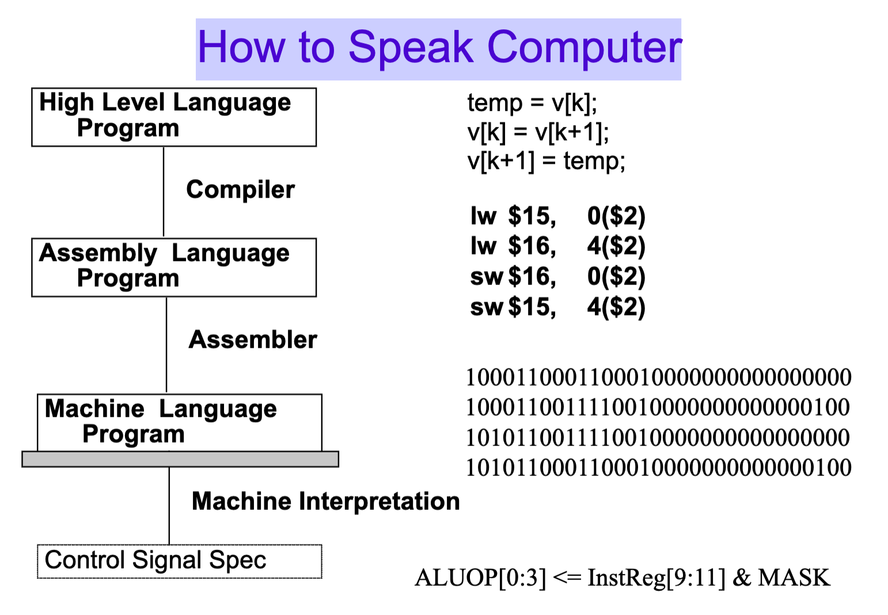
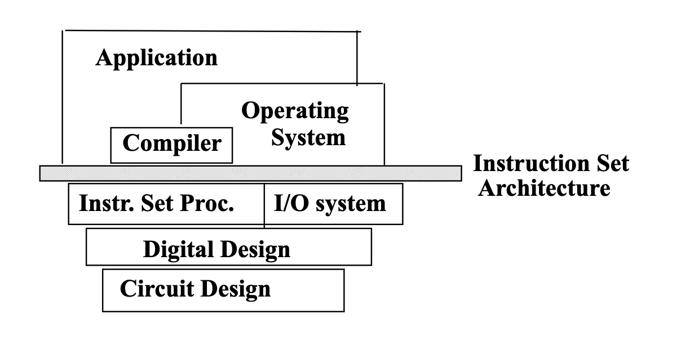
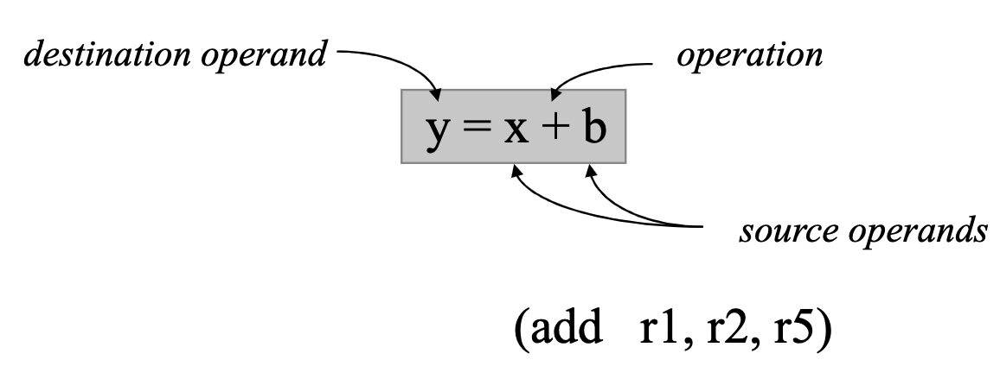

# CSE141 01: Intro

To view the original lecture notes provided by the professor, please visit at [this link](files/cse141_01.pdf).

- [CSE141 01: Intro](#cse141-01-intro)
  - [Hardware Designer vs. Computer Architect](#hardware-designer-vs-computer-architect)
  - [Computer Architecture](#computer-architecture)
  - [The Instruction Set Architecture](#the-instruction-set-architecture)
    - [Computer Organization](#computer-organization)

## Hardware Designer vs. Computer Architect
- Hardware Designer
    - thinks about circuits, 
components, timing, 
functionality, ease of 
debugging
    - “construction engineer”

- Computer Architect
    - thinks about high-level  components, how they fit 
together, how they work 
together to deliver 
performance.
    - “building architect”
- Why care?
    - You may actually do computer architecture someday
    - You may actually care about software performance 
someday
        - The ability of application programs, compilers, operating systems, etc. 
to deliver performance depends critically on an understanding of the 
underlying computer organization.
        - That becomes more true every year.
          - Up until about 10 years ago, that was primarily due to the increasing 
complexity of the core microarchitecture
         - Since, it is more about the reliance on hardware parallelism and hardware 
heterogeneity
    - You may actually care about computer security
        - Most of the newest and most insidious security attacks have focused 
on microarchitectural details.

## Computer Architecture
- Computer Architecture =
Machine Organization  + 
Instruction Set Architecture
    - Machine Organization: What the machine 
hardware looks like
    - Instruction Set Architecture: How you talk to the machine
- How to Speak Computer

## The Instruction Set Architecture
- that part of the architecture that is visible to the 
programmer
    - opcodes (available instructions)
    - number and types of registers
    - instruction formats
    - storage access, addressing modes
    - exceptional conditions
- It is the agreed-upon interface between all the software that runs on the 
machine and the hardware that executes it.

- The Instruction Execution Cycle
  1. Instruction
Fetch: Obtain instruction from program storage
    2. Instruction
Decode: Determine required actions and instruction size
    3. Operand
Fetch: Locate and obtain operand data
    4. Execute: Compute result value or status
    5. Result
Store: Deposit results in storage for later use
    6. Next
Instruction: Determine successor instruction
- Key ISA decisions
    - operations
      - how many?
      - which ones
    - operands
      - how many?
      - location
      - types
      - how to specify?
    - instruction format 
      - size
      - how many formats?

### Computer Organization
- Once you have decided on an ISA, you must decide how to 
design the hardware to execute those programs written in 
the ISA as fast as possible (or as cheaply as possible, or 
using as little power as possible, ...). 
- This must be done every time a new implementation of the 
architecture is released, with typically very different 
technological constraints.