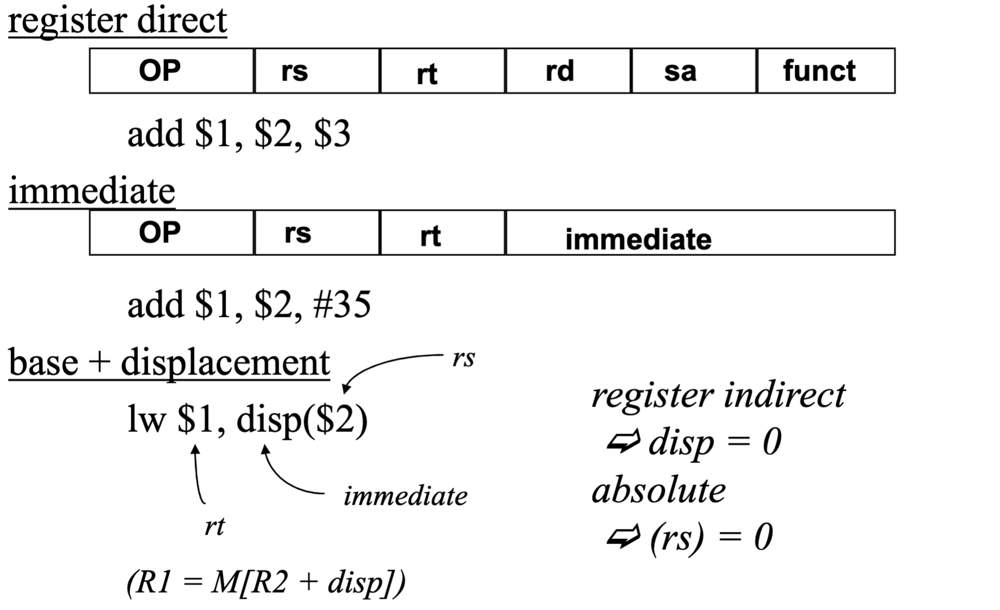
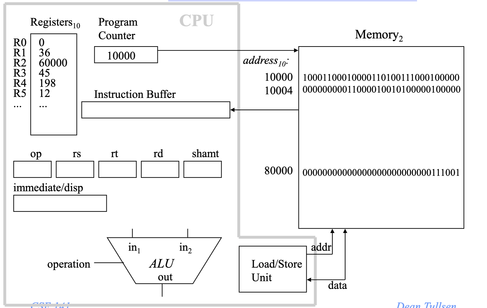
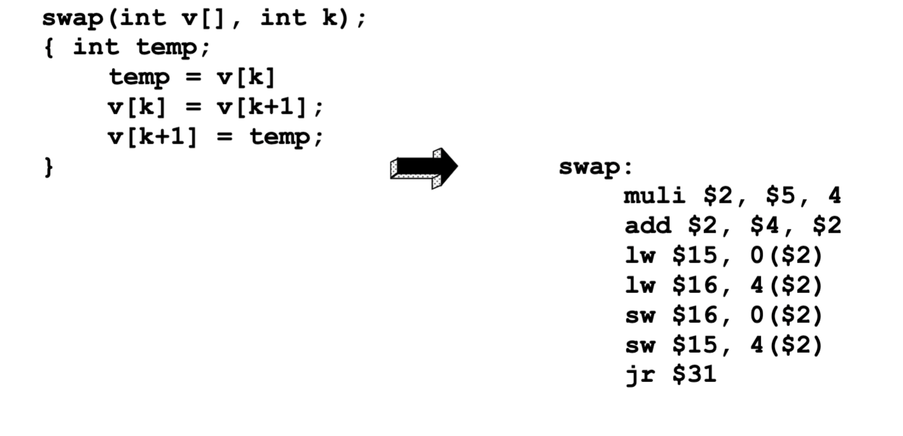

# CSE141 02: Instruction Set Architecture

- [CSE141 02: Instruction Set Architecture](#cse141-02-instruction-set-architecture)
  - [Brief Vocabulary Lesson](#brief-vocabulary-lesson)
  - [The Instruction Execution Cycle](#the-instruction-execution-cycle)
  - [ISA decisions](#isa-decisions)
    - [Instruction Length](#instruction-length)
    - [Instruction Formats](#instruction-formats)
    - [Accessing the Operands](#accessing-the-operands)
    - [Which instructions?](#which-instructions)
    - [Control Flow](#control-flow)
  - [Basic ISA Classes](#basic-isa-classes)
    - [Accumulator](#accumulator)
    - [Stack](#stack)
    - [General Purpose Register](#general-purpose-register)
    - [Load/Store](#loadstore)
    - [MISP Operands](#misp-operands)
  - [Instruction Execution in a CPU](#instruction-execution-in-a-cpu)
  - [Example from C to ASM](#example-from-c-to-asm)
  - [RISC Architectures](#risc-architectures)
  - [RISC-V](#risc-v)
  - [Alternative Architectures](#alternative-architectures)

## Brief Vocabulary Lesson
- parallelism -- the ability to do more than one thing at once.
- superscalar processor -- can execute more than one 
instruction per cycle.
- cycle -- smallest unit of time in a processor.
- pipelining -- overlapping parts of a large task to increase 
throughput without decreasing latency


## The Instruction Execution Cycle
1. Instruction
Fetch: Obtain instruction from program storage
1. Instruction
Decode: Determine required actions and instruction size
1. Operand
Fetch: Locate and obtain operand data
 1. Execute: Compute result value or status
 2. Result
Store: Deposit results in storage for later use
 1. Next
Instruction: Determine successor instruction

## ISA decisions
### Instruction Length
- Variable-length instructions (Intel 80x86, VAX) require 
multi-step fetch and decode, but allow for a much more 
flexible and compact instruction set.
- Fixed-length instructions allow easy fetch and decode, and 
simplify pipelining and parallelism.
- All MIPS instructions are 32 bits long.
    - this decision impacts every other ISA decision we make because it 
makes instruction bits scarce.
### Instruction Formats
>what does each bit mean?
- Having many different instruction formats...
    - complicates decoding 
    - uses more instruction bits (to specify the format)
    - Could allow us to take full advantage of a variable-length ISA
    
### Accessing the Operands
- operands are generally in one of two places:
    - registers (32 int, 32 fp)
    - memory (232 locations) 
- registers are
    - easy to specify
    - close to the processor (fast access)
- the idea that we want to access registers whenever possible 
led to load-store architectures.
    - normal arithmetic instructions only access registers
    - only access memory with explicit loads and stores
- Load-store architectures
  - Can Do
    ```asm
    add r1=r2+r3
    load r3, M(address)
    ```
  - Can't Do
    ```asm
    add r1 = r2 + M(address)
    ```
  - forces heavy dependence on 
registers, which is exactly what 
you want in today’s CPUs
  - more instructions
  - fast implementation (e.g., easy 
pipelining)
- How Many Operands?
    -  Most instructions have three operands (e.g., z = x + y).
    - Well-known ISAs specify 0-3 (explicit) operands per 
instruction.
    - Operands can be specified implicitly or explicity.
- Addressing Modes
  >how do we specify the operand we want?

  | Mode | Example | 
  | --- | --- |
  |Register direct| R3|
  |Immediate |(literal) #25
  | Direct (absolute)| M[10000]
  | Register indirect | M[R3]
  | Base+Displacement |M[R3 + 10000]
  | Base+Index| M[R3 + R4]
  | Scaled Index |M[R3 + R4*d + 10000]
  | Autoincrement |M[R3++]
  | Autodecrement |M[R3 - -]
  | Memory Indirect| M[ M[R3] ]'
- MIPS addressing modes
  
- Is this sufficient?
    - measurements on the VAX (super complex ISA) show that 
these addressing modes (immediate, direct, register 
indirect, and base+displacement) represent 88% of all 
addressing mode usage. 
    - similar measurements show that 16 bits is enough for the 
immediate 75 to 80% of the time
    - and that 16 bits is enough of a displacement 99% of the 
time.
    - (and when these are not sufficient, it typically means we 
need one more instruction)
- Memory Organization (digression)
  - Viewed as a large, single-dimension array, with an address.
  - A memory address is an index into the array
  - "Byte addressing" means that the index (address) points to a 
byte of memory.
  - Bytes are nice, but most data items use larger "words"
  - For MIPS32, a word is 32 bits or 4 bytes.
  - If addresses are 32 bits, then we can think of memory as
    - 232 bytes with byte addresses from 0, 1, to 232-1
    - 230 words with byte addresses 0, 4, 8, ... 232-4
  - Words are aligned
    - i.e., what are the  least 2 significant bits of a word 
address?
  - (The MIPS64 ISA, however, has 64-bit registers)
### Which instructions?
- arithmetic
  - add, subtract, multiply, divide
- logical
  - and, or, shift left, shift right
- data transfer
  - load word, store word
- conditional branch
- unconditional jump
### Control Flow
- Jumps
  - need to be able to jump to an absolute address sometimes
  - need to be able to do procedure calls and returns
  - jump 
    - j 10000  => PC = 10000
  - jump and link
    - jal 100000 => $31 = PC + 4; PC = 10000
    - used for procedure calls
  - jump register
    - jr $31 => PC = $31
    - used for returns, but can be useful for lots of other things.
- Procedure call (jump subroutine)
- Conditional Branch
- Used to implement, for example, if-then-else logic, loops, etc.
    - A conditional branch must specify two things
    - How do you specify the destination (target) of a 
branch/jump?
    - studies show that almost all conditional branches go short 
distances from the current program counter (loops, if-then-
else).
        - we can specify a relative address in much fewer bits than an 
absolute address
        - e.g., beq $1, $2, 100    => if ($1 == $2) PC = (PC+4) + 100 * 4
    - MIPS conditional branches
      - beq, bne 
        - beq r1, r2, addr => if (r1 == r2) goto addr
      - slt
        - slt $1, $2, $3  =>  if ($2 < $3) $1 = 1; else $1 = 0
      - these, combined with $0, can implement all fundamental 
branch conditions
- Condition under which the branch is taken 
- Location that the branch jumps to if taken (target)
- Branch and Jump Addressing Modes
  - Branch (e.g., beq) uses PC-relative addressing mode (uses 
few bits if address typically close).  That is, it uses 
base+displacement mode, with the PC being the base.  If 
opcode is 6 bits, how many bits are available for 
displacement?  How far can you jump?
  - Jump uses pseudo-direct addressing mode.  26 bits of the 
address is in the instruction, the rest is taken from the PC.

## Basic ISA Classes
### Accumulator
| Number of address | Syntex | Exaplanation |
| --- | --- | ---|
| 1 | add A | acc <- acc + mem[A]

### Stack
| Number of address | Syntex | Exaplanation |
| --- | --- | ---|
| 0 | add | tos <- tos + next |

### General Purpose Register
| Number of address | Syntex | Exaplanation |
| --- | --- | ---|
| 2 | add A B | EA(A) <- EA(A) + EA(B)|
| 3 | add A B C | EA(A) <- EA(B) + EA(C)|

### Load/Store
| Number of address | Syntex | Exaplanation |
| --- | --- | ---|
|3(restricted) | add Ra Rb Rc | Ra <- Rb + Rc|
|3(restricted) | load Ra Rb | Ra <- mem[Rb]|
|3(restricted) | store Ra Rb | mem[Rb] <- Ra|

### MISP Operands


## Instruction Execution in a CPU


## Example from C to ASM


## RISC Architectures
- MIPS, like SPARC, PowerPC, and Alpha AXP, is a RISC (Reduced 
Instruction Set Computer) ISA.
    - fixed instruction length
    - few instruction formats
    -  load/store architecture
  - RISC architectures worked because they enabled pipelining. They 
continue to thrive because they enable parallelism.

## RISC-V
- MIPS was the commercialization of the Berkeley RISC project (ie, 
RISC-I).  While MIPS is no longer an important ISA, the original 
RISC (now RISC-V) has been resurrected and may be one of the most 
important ISAs going forward.
    - Public domain
    - Crowd sourced design, software, etc.

## Alternative Architectures
- Design alternative:
    - provide more powerful operations
    - goal is to reduce number of instructions executed
    - danger is a slower cycle time and/or a higher CPI (cycles per 
instruction)
- Sometimes referred to as “RISC vs. CISC”
    - CISC = Complex Instruction Set Computer (as alt to RISC)
    - virtually all new instruction sets since 1982 have been RISC
    - VAX:  minimize code size, make assembly language easy
instructions from 1 to 54 bytes long!
- PowerPC
    - Indexed addressing
      ```asm
      lw $t1,$a0+$s3  #$t1=Memory[$a0+$s3] 
      ```
    - Update addressing
        - update a register as part of load (for marching through arrays)
      ```asm
      lwu $t0,4($s3) #$t0=Memory[$s3+4];$s3=$s3+4
    - Others:
        - load multiple/store multiple
        -  a special counter register  “bc Loop”   
            - decrement counter, if not 0 goto loop
 - 80x86
    - 1978:  The Intel 8086 is announced (16 bit architecture)
    - 1980:  The 8087 floating point coprocessor is added
    - 1982:  The 80286 increases address space to 24 bits, +instructions
    - 1985:  The 80386 extends to 32 bits, new addressing modes
    - 1989-1995:  The 80486, Pentium, Pentium Pro add a few  instructions
(mostly designed for higher performance)
    - 1997:  MMX is added
    - 1999: Pentium III (same architecture)
    - 2001: Pentium 4 (144 new multimedia instructions), simultaneous 
multithreading (hyperthreading)
    - 2005: dual core Pentium processors
    - 2006: quad core (sort of) Pentium processors
    - 2009: Nehalem – eight-core multithreaded (SMT) processors
    - 2015: Skylake – multicore, multithreaded, added hw security features, 
transactional memory, ...
    - 2021 Alder Lake – heterogeneous multicore, multithreaded.
    - Complexity:
      - Instructions from 1 to 17 bytes long
      - one operand must act as both a source and destination
      - one operand can come from memory
      - complex addressing modes
        - e.g., “base or scaled index with 8 or 32 bit displacement”
    - Saving grace:
        - the most frequently used instructions are not too difficult to build
        - compilers avoid the portions of the architecture that are slow
        - Some other tricks we’ll talk about later.
- Key Points
    - MIPS is a general-purpose register, load-store, fixed-
instruction-length architecture.
    - MIPS is optimized for fast pipelined performance, not for 
low instruction count
    - Historic architectures favored code size over parallelism.
    - MIPS most complex addressing mode, for both branches 
and loads/stores is base + displacement.