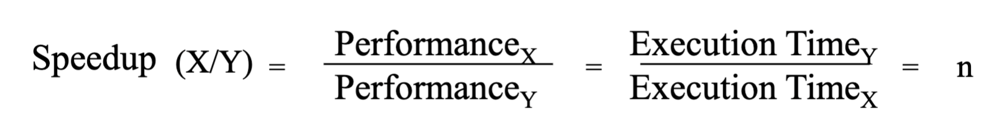
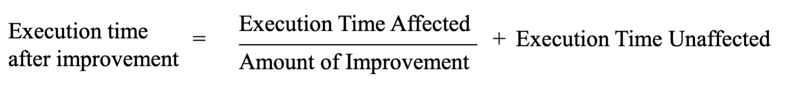

# CSE141 03: Computer System Performance

- [CSE141 03: Computer System Performance](#cse141-03-computer-system-performance)
  - [Performance](#performance)
    - [Measures of “Performance”](#measures-of-performance)
    - [How to measure Execution Time?](#how-to-measure-execution-time)
    - [Relative Performance](#relative-performance)
  - [Time](#time)
    - [What is Time?](#what-is-time)
    - [How many clock cycles?](#how-many-clock-cycles)
  - [Amdahl’s Law](#amdahls-law)

## Performance
### Measures of “Performance”
- Execution Time
- Frame Rate
- Throughput (operations/time)
- Transactions/sec, queries/day, etc.
- Responsiveness
- Performance / Cost
- Performance / Power 
- Performance / Energy

### How to measure Execution Time?

- only has meaning in the context of a program or workload
- Not very intuitive as an absolute measure, but most of the 
time we’re more interested in relative performance.

### Relative Performance
- can be confusing
  ```
  A runs in 12 seconds
  B runs in 20 seconds
  – A/B = .6 , so A is 40% faster, or 1.4X faster, or B is 40% slower
  – B/A = 1.67, so A is 67% faster, or 1.67X faster, or B is 67% 
  slower
  ```
- needs a precise definition
- Relative Performance (Speedup), the 
Definition


## Time
### What is Time?
- CPU Execution Time = CPU clock cycles * Clock cycle time
  - Every conventional processor has a clock with an associated clock 
cycle time or clock rate
  - Every program runs in an integral number of clock cycles
  - Cycle Time
    - GHz = billions of cycles/second
    - MHz = millions of cycles/second
    - Y GHz = 1/Y nanoseconds cycle time
### How many clock cycles?
- Number of CPU clock cycles = Instruction count * Average 
Clock Cycles per Instruction (CPI)

## Amdahl’s Law
- The impact of a performance improvement is limited by 
the fraction of execution time affected by the improvement
- Make the common case fast!!         (usually)

