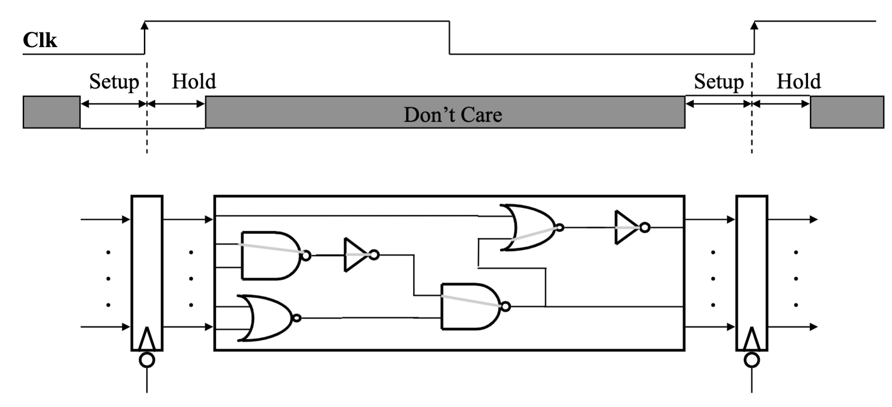

# CSE141 04: Single Data Path

To view the original lecture notes provided by the professor, please visit at [this link](files/cse141_04.pdf).

- [CSE141 04: Single Data Path](#cse141-04-single-data-path)
  - [Components of a Computer](#components-of-a-computer)
  - [The Performance Perspective](#the-performance-perspective)
  - [Clocking Methodology](#clocking-methodology)
  - [The Processor:  Datapath \& Control](#the-processor--datapath--control)
  - [2’s complement](#2s-complement)
  - [Execute: Arithmetic](#execute-arithmetic)
    - [ALU: Arithmetic Logic Unit](#alu-arithmetic-logic-unit)
    - [A One Bit ALU](#a-one-bit-alu)
    - [A 32-bit ALU](#a-32-bit-alu)
    - [Subtraction](#subtraction)
    - [Full ALU](#full-alu)
    - [The Disadvantage of Ripple Carry](#the-disadvantage-of-ripple-carry)
  - [Floating Point](#floating-point)
  - [RTL: Register Transfer Language](#rtl-register-transfer-language)
  - [Review:  The MIPS Instruction Formats](#review--the-mips-instruction-formats)
  - [Storage elements](#storage-elements)
    - [Storage Element: Register](#storage-element-register)
  - [Putting it All Together: A Single Cycle Datapath](#putting-it-all-together-a-single-cycle-datapath)
  - [key Points](#key-points)

## Components of a Computer

- Control
- Datapath
- Memory
- Input
- Output

## The Performance Perspective
- Processor design (datapath and control) will determine:
    - Clock cycle time
    - Clock cycles per instruction
-  Single cycle processor:
    - Advantage: One clock cycle per instruction
    - Disadvantage: long cycle time

## Clocking Methodology
- All storage elements are clocked by the same clock edge
- This picture is valid whether we’re talking about a single-cycle 
processor, multi-cycle processor, pipelined processor, ...


## The Processor:  Datapath & Control
- We’re going to look at an implementation of MIPS simplified to 
contain only:
    - memory-reference instructions:  lw, sw
    - arithmetic-logical instructions:  add, sub, and, or, slt
    - control flow instructions:  beq
- Generic Implementation:
    - use the program counter (PC) to supply instruction address
    - get the instruction from memory
    - read registers
    - use the instruction to decide exactly what to do

## 2’s complement
- We would like a number systemthat provides
    - obvious representation of 0,1,2...
    - uses an adder for both unsigned and signed addition
    - single value of 0
    - equal coverage of positive and negative numbers
    - easy detection of sign
    - easy negation
- 2’s complement representation of negative numbers
  - Take the bitwise inverse and add 1
- Biggest 4-bit Binary Number: 7 Smallest 4-bit Binary Number: -8
  

## Execute: Arithmetic

### ALU: Arithmetic Logic Unit
  
### A One Bit ALU
- This 1-bit ALU will perform AND, OR, and ADD for a single bit 
position.

### A 32-bit ALU

### Subtraction
- Keep in mind the following:
    - (A - B) is the same as: A + (-B)
    - 2’s Complement negate: Take the inverse of every bit and add 1
- Bit-wise inverse of B is !B:
    - A - B = A + (-B) = A + (!B + 1) = A + !B + 1 

### Full ALU

### The Disadvantage of Ripple Carry
- The adder we just built is called a “Ripple Carry Adder”
  - The carry bit may have to propagate from LSB to MSB
  - Worst case delay for an N-bit RC adder: 2N-gate delay
- The point -> ripple carry adders are slow.  Faster addition schemes are 
possible that acceleratethe movement of the carry from one end to the other.

## Floating Point
- Typically will have their own ALU (and register file!)
- Because they require normalization, then math, then 
renormalization, then rounding (a lot of serialized steps)...
- FP computations are always slower than integer.
    - Eg, Skylake
    ```asm
    Int add 1, int mul 4, FP add 3, FP mul 5
    ```
## RTL: Register Transfer Language
- It is a mechanism for describing the movement and 
manipulation of data between storage elements:
  ```asm
  R[3] <- R[5] + R[7]
  PC <- PC + 4 + R[5]
  R[rd] <- R[rs] + R[rt]
  R[rt] <- Mem[R[rs] + immed]
  ```
## Review:  The MIPS Instruction Formats
All MIPS instructions are 32 bits long.  The three  instruction formats:

- R-type
    - add rd, rs, rt
    - sub, and, or, slt
- LOAD and STORE
    - lw rt, rs, imm16
    -  sw rt, rs, imm16
- BRANCH:
    -  beq rs, rt, imm16
## Storage elements
- RTL describes data movement between storage elements, 
but we don’t actually have our data elements yet.
### Storage Element: Register
- Register
  - Similar to the D Flip Flop except
    -  N-bit input and output
    - Write Enable input
  - Write Enable:
     - 0: Data Out will not change
    - 1: Data Out will become Data In (on the clock edge)
- But we need a whole bunch of registers
  - Register File

## Putting it All Together: A Single Cycle Datapath
- We have everything except control signals (later)


## key Points
- CPU is just a collection of state and combinational logic
- We just designed a the datapath for a very rich processor, 
at least in terms of functionality
- ET = IC * CPI * Cycle Time
- where does the single-cycle machine fit in?