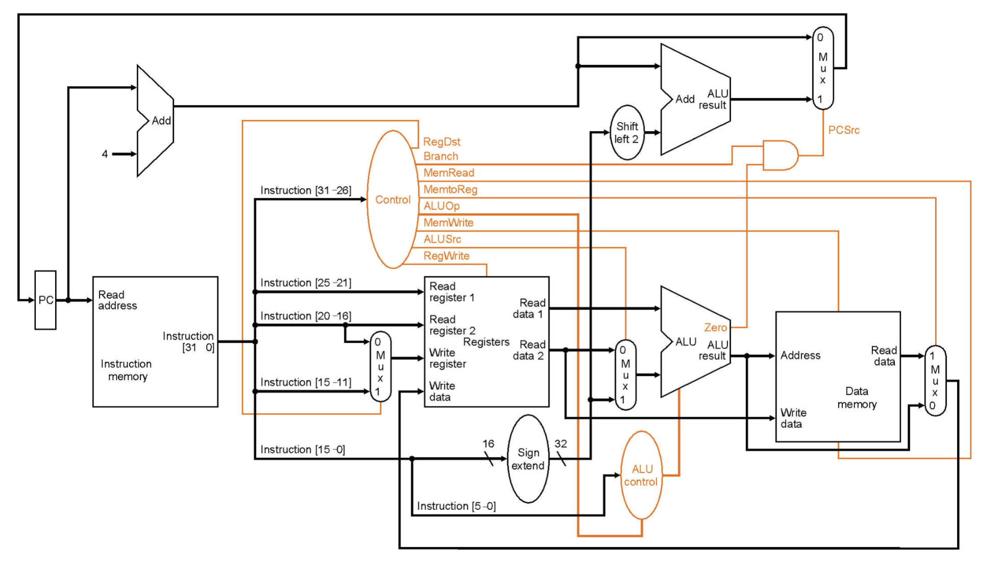
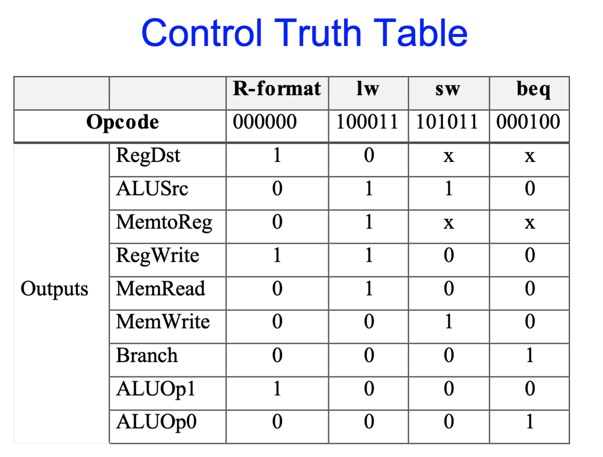

# CSE141 05: Control Logic for the Single-Cycle CPU

- [CSE141 05: Control Logic for the Single-Cycle CPU](#cse141-05-control-logic-for-the-single-cycle-cpu)
- [Main](#main)
  - [Control Signal](#control-signal)
    - [ALU Control](#alu-control)
    - [Control](#control)
  - [Single-Cycle CPU Summary](#single-cycle-cpu-summary)

# Main
## Control Signal

### ALU Control

- Generating ALU control
  
  | Instruction opcode | ALUOp | Instruction operation | Function code | Desired ALU action | ALU control input|
  | --- | --- | --- | --- | --- | --- |
  |lw| 00 |load word| xxxxxx| add| 010
  |sw |00 |store word |xxxxxx |add |010
  |beq |01| branch eq |xxxxxx |subtract| 110
  |R-type |10| add |100000| add |010
  |R-type |10 |subtract |100010| subtract |110
  |R-type |10 |AND |100100| and| 000
  |R-type |10 |OR |100101 |or |001
  |R-type| 10 |slt| 101010| slt| 111
- logic equations
    - ALUctr2 = (!ALUop1 & ALUop0) | (ALUop1 & Func1)
    - ALUctr1 = !ALUop1 | (ALUop1 & !Func2) 
    - ALUctr0 =ALUop1 & (Func0 | Func3)
- Control Truth Table

### Control
- Simple combinational logic (truth tables)
- And again, just in case you wanted to see the logic:

## Single-Cycle CPU Summary
- Easy, particularly the control
- Which instruction takes the longest?  By how much?  Why 
is that a problem?
- ET = IC  *  CPI  *  CT
- What else can we do?
- When does a multi-cycle implementation make sense?
– e.g., 70% of instructions take 75 ns, 30% take 200 ns?
– suppose 20% overhead for extra latches
- Real machines have much morevariable instruction 
latencies than this.