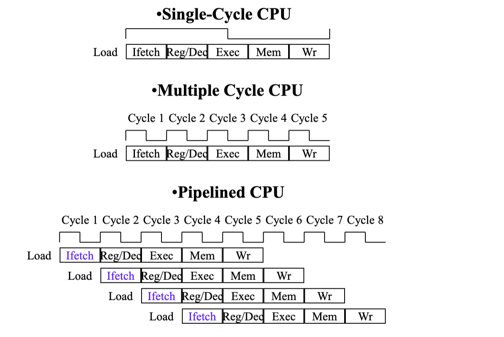
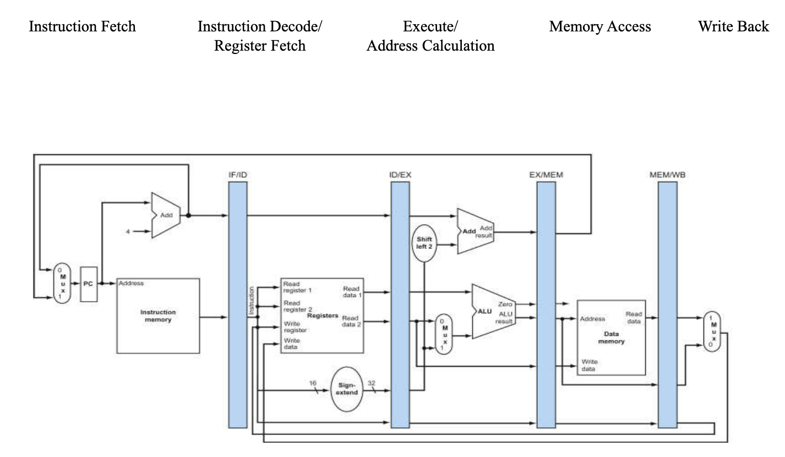
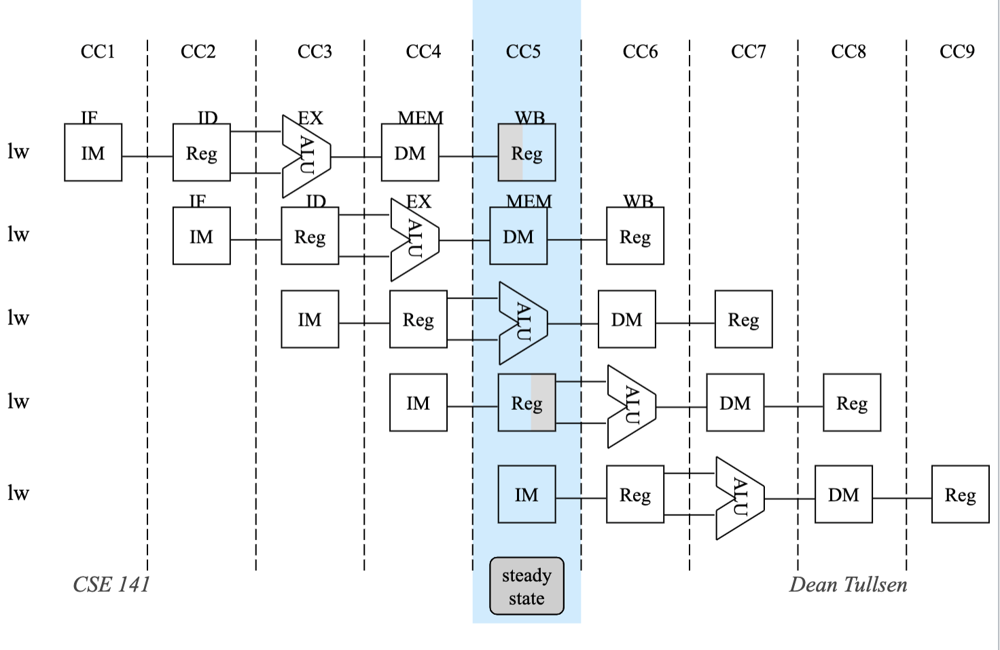
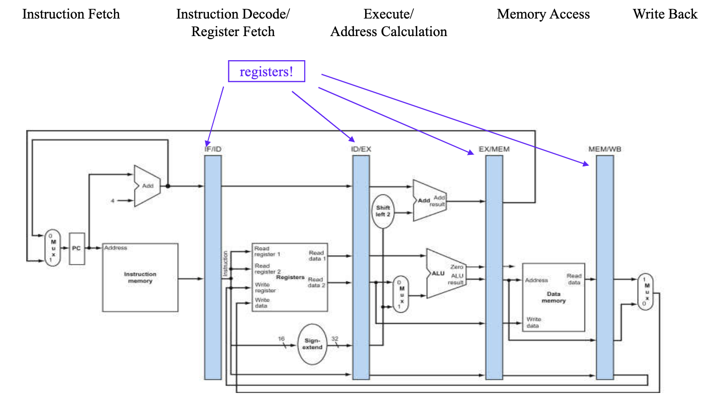
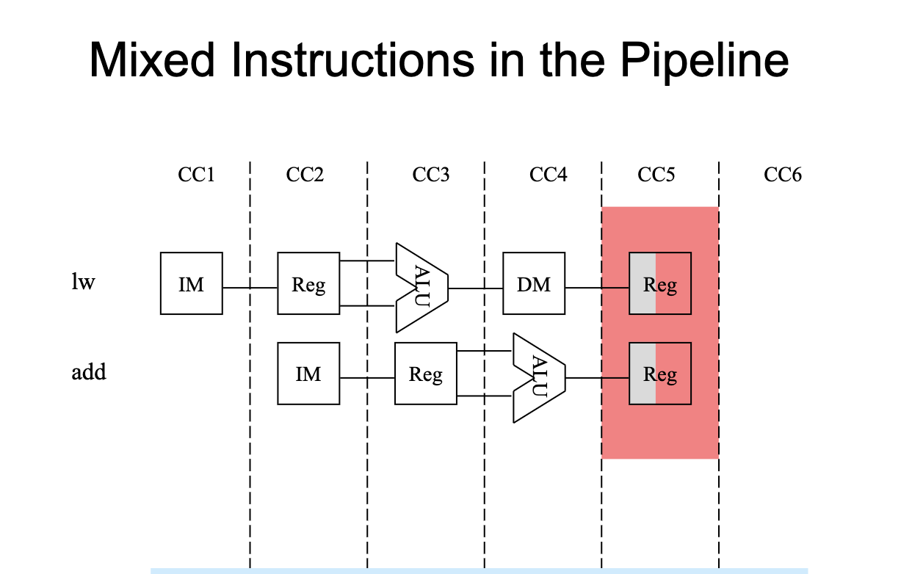
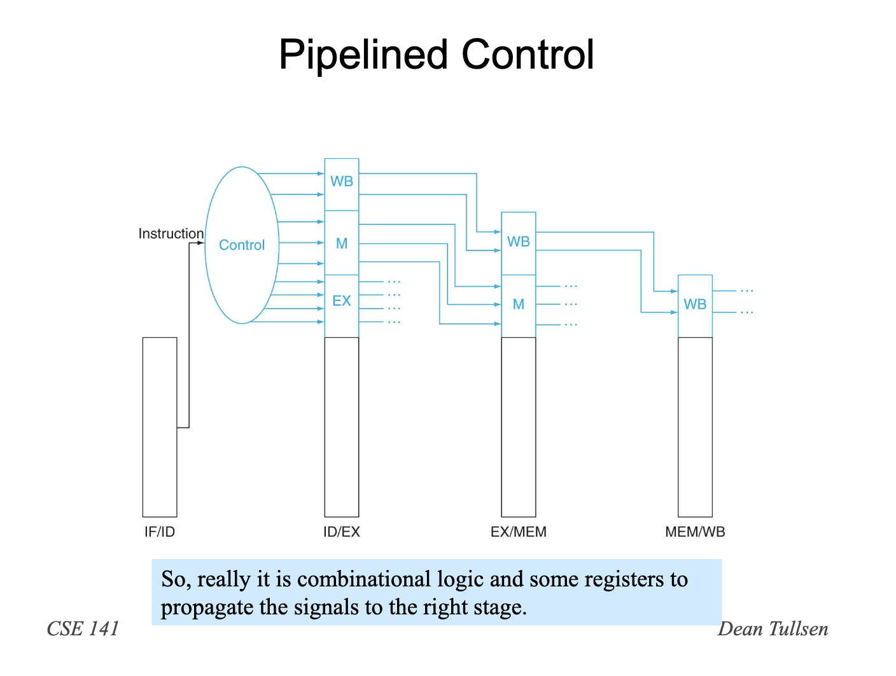
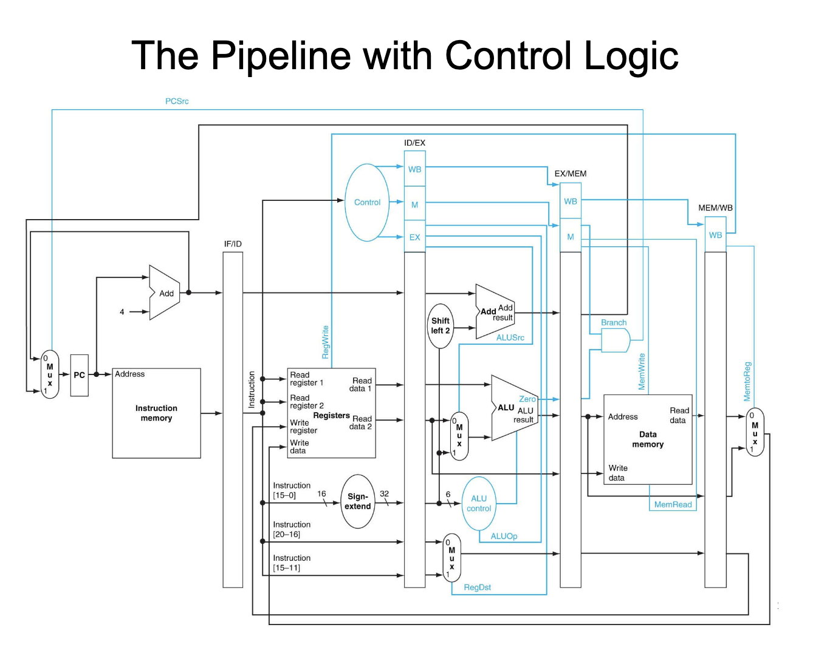

# CSE141 06: Designing a Pipelined CPU

- [CSE141 06: Designing a Pipelined CPU](#cse141-06-designing-a-pipelined-cpu)
  - [Instruction Latencies and Throughput](#instruction-latencies-and-throughput)
  - [Pipelining Advantages](#pipelining-advantages)
  - [A Pipelined Datapath](#a-pipelined-datapath)
  - [Structural Hazard](#structural-hazard)
  - [Pipeline Principles](#pipeline-principles)
  - [Pipelined Control](#pipelined-control)
  - [Pipelining Key Points](#pipelining-key-points)

## Instruction Latencies and Throughput

## Pipelining Advantages
- Higher maximum throughput
- Higher utilization of CPU resources
- But, more complicated datapath, more complex control

## A Pipelined Datapath
- IF: Instruction fetch
- ID: Instruction decode and register fetch
- EX: Execution and effective address calculation
- MEM:  Memory access
- WB:  Write back

## Structural Hazard

This is called a structural hazard – too many instructions 
want to use the same resource.
In our pipeline, we can make this hazard disappear (next 
slide).  In more complex pipelines, structural hazards are 
again possible.

## Pipeline Principles
- All instructions that share a pipeline should have the same 
stagesin the same order.
  - therefore, adddoes nothing during Mem stage
  - swdoes nothing during WB stage
- All intermediate values must be latched each cycle.

## Pipelined Control

## Pipelining Key Points
- ET = IC * CPI * CT
- We achieve high throughputwithout reducing instruction                
latency.
- Pipelining exploits a special kind of parallelism 
(parallelism between functionality required in different 
cycles by different instructions).
- Pipelining uses combinational logic to generate (and 
registers to propogate) control signals.
- Pipelining creates potential hazards.