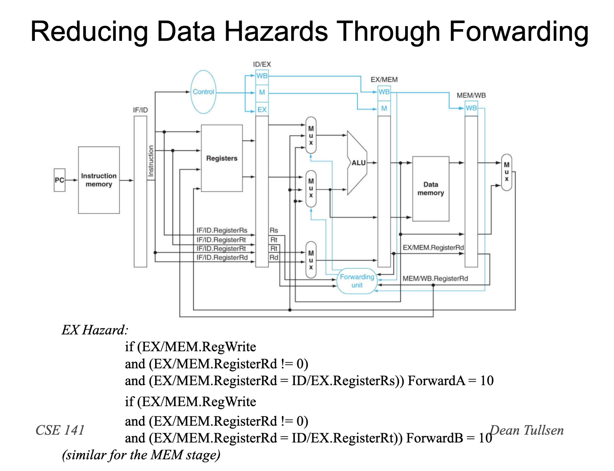

# CSE141 07: Pipeline Data Hazards

- [CSE141 07: Pipeline Data Hazards](#cse141-07-pipeline-data-hazards)
  - [Data Hazards](#data-hazards)
  - [Dealing with Data Hazards in Software](#dealing-with-data-hazards-in-software)
  - [Dealing with Data Hazards in Hardware](#dealing-with-data-hazards-in-hardware)
    - [Part II-Pipeline Stalls](#part-ii-pipeline-stalls)
    - [Reducing Data Hazards Through Forwarding](#reducing-data-hazards-through-forwarding)
  - [Data Hazard Key Points](#data-hazard-key-points)

## Data Hazards
- Data Hazards are caused by data 
dependences.
- Not all data dependences result in data 
hazards
- A data hazard results when there is a data 
dependence between two instructions that 
appear too close together in the pipeline.
- More specifically, we will define a data 
hazard as any data dependence that requires 
either the software or hardware to take 
special action to get correct.

## Dealing with Data Hazards in Software
- USING No-OPs

## Dealing with Data Hazards in Hardware

### Part II-Pipeline Stalls

- To insure proper pipeline execution in light of register 
dependences, we must:
  - detect the hazard
  - stall the pipeline
- Once we detect a hazard, then we have to be able to stall 
the pipeline (insert a bubble).
- Stalling the pipeline is accomplished by 
  - preventing the IF and ID stages from making progress
    - the ID stage because it cannot proceed until the dependent instruction 
completes
    - the IF stage because we do not want to lose any instructions.
  - essentially, inserting “nops” in hardware
- Preventing the IF and ID stages from proceeding
  - don’t write the PC (PCWrite = 0)
  - don’t rewrite IF/ID register (IF/IDWrite = 0)
- Inserting “nops”
  - set all control signals propagating to EX/MEM/WB to zero

### Reducing Data Hazards Through Forwarding

- The Previous Data Path handles two types of data hazards
    - EX hazard
    - MEM hazard
- We assume the register file handles the third (WB hazard)
    - if the register file is asked to read and write the same register in the 
same cycle, we assume that the reg file allows the write data to be 
forwarded to the output
    -  We’re still going to call that forwarding.

## Data Hazard Key Points
- Pipelining provides high throughput, but does not handle 
data dependences easily.
- Data dependences cause data hazards.
-  Data hazards can be solved by:
    - software (nops)
    - hardware stalling
    - hardware forwarding
- Our processor, and indeed all modern processors, use a 
combination of forwarding and stalling.
- ET = IC * CPI * CT