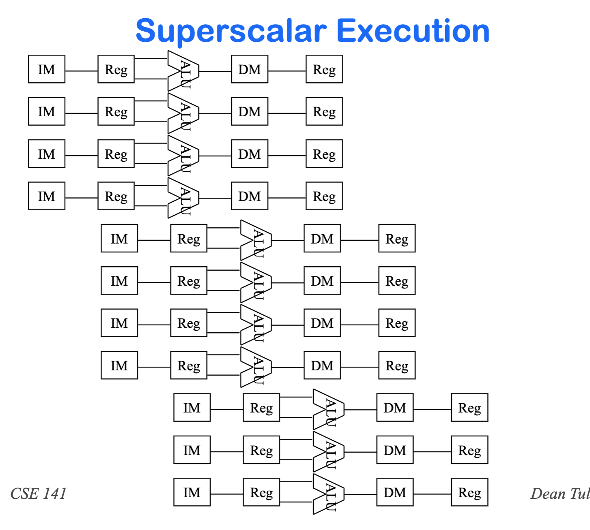
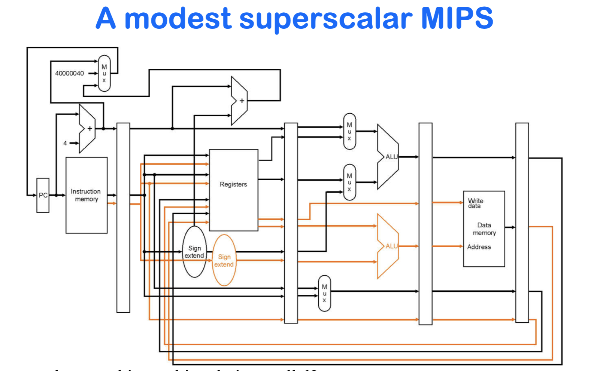

# CSE141 09: Exception and Advanced Pipelining

- [CSE141 09: Exception and Advanced Pipelining](#cse141-09-exception-and-advanced-pipelining)
  - [Exceptions](#exceptions)
  - [Supporting exceptions](#supporting-exceptions)
  - [Pipelining and Exceptions](#pipelining-and-exceptions)
  - [Advanced Pipelining](#advanced-pipelining)
    - [Pipelining in Today’s Most Advanced Processors](#pipelining-in-todays-most-advanced-processors)
    - [Superscalar Execution](#superscalar-execution)
    - [Models of Superscalar Execution](#models-of-superscalar-execution)
  - [Pipelining -- Key Points](#pipelining----key-points)

## Exceptions
- There are two sources of non-sequential control flow in a 
processor
    - explicit branch and jump instructions
    -  exceptions
- Branches are synchronous and deterministic
- Exceptions are typically asynchronous and non-
deterministic
- Guess which is more difficult to handle?
- the terminology is not consistent, but we’ll refer to
    - exceptions as any unexpected change in control flow
    - interrupts as any externally-caused exception

- So then, what is:
    – arithmetic overflow
    – divide by zero
    – I/O device signals completion to CPU
    – user program invokes the OS
    – memory parity error
    – illegal instruction
    – timer signal

- The limited machine we’ve been designing in class can 
only generate two types of exceptions.
    - arithmetic overflow
    - illegal instruction
- On an exception, we need to
    - save the PC (invisible to user code)
    - record the nature of the exception/interrupt
    - transfer control to OS (what does that entail?  Set PC to a new 
address and maybe flush some instructions)

## Supporting exceptions
- For our MIPS-subset architecture, we will add two 
registers:
    - EPC:  a 32-bit register to hold the user’s PC
    - Cause:  A register to record the cause of the exception
        -  we’ll assume undefined inst = 0, overflow = 1
- We will also add three control signals:
    - EPCWrite (will need to be able to subtract 4 from PC)
    - CauseWrite
    - IntCause
- We will extend PCSource multiplexor to be able to 
latch the interrupt handler address into the PC.

## Pipelining and Exceptions
- Again, exceptions represent another form of control flow 
and therefore control dependence.
- Therefore, they create a potential branch hazard
- Exceptions must be recognized early enough in the 
pipeline that subsequent instructions can be flushed before 
they change any permanent state.
- We also have issues with handling exceptions in the 
correct order and “exceptions” on speculative instructions.
    - Exception-handling that always correctly identifies the offending 
instruction is called precise interrupts.

## Advanced Pipelining

### Pipelining in Today’s Most Advanced Processors
- Not fundamentally different than the techniques we 
discussed
- Deeper pipelines
- Pipelining is combined with 
    - superscalar execution
    - out-of-order execution
or possibly...
- VLIW (very-long-instruction-word)

### Superscalar Execution

- The earliest superscalar machines (see figures previous 
slides) were derived from scalar hardware, after noting that 
they already had distinct ALUs for various types of 
instructions – integer/load-store/FP – so they didn’t have to 
add a lot of hardware to do 2 of those at once.
- Once we had superscalar processors, it didn’t take long to 
measure the performance and say “if we had 2 (3, 4?) 
integer ALUs instead of 1...”
- So then there was a move to much more hardware
replication. But not complete replication.
    - You may be able to do 4 integer adds, but not 4 load/store, not 4 
FP multiplies, etc.

### Models of Superscalar Execution
To execute four instructions in the same cycle, we must 
find four independent instructions
- If the four instructions fetched are guaranteed by the 
compiler to be independent, this is a VLIW machine
machine (e.g., Intel IA64/Itanium).
- If (up to) four consecutive instructions are only executed 
together if hardware confirms that they are independent, 
this is an in-order superscalar processor.
- If the hardware actively finds four (not necessarily 
consecutive) instructions that are independent, this is an 
out-of-order superscalar processor.
- What do you think are the tradeoffs?

## Pipelining -- Key Points
- ET = Number of instructions * CPI * cycle time
- Data hazards and branch hazards prevent CPI from 
reaching 1.0, but forwarding and branch prediction get it 
pretty close.
- Data hazards and branch hazards need to be detected by 
hardware.
- Pipeline control uses combinational logic.  All data and 
control signals move together through the pipeline.
- Scalar pipelining attempts to get CPI close to 1.  To 
improve performance we must reduce CT 
(superpipelining) or get CPI below one (superscalar, 
VLIW).

