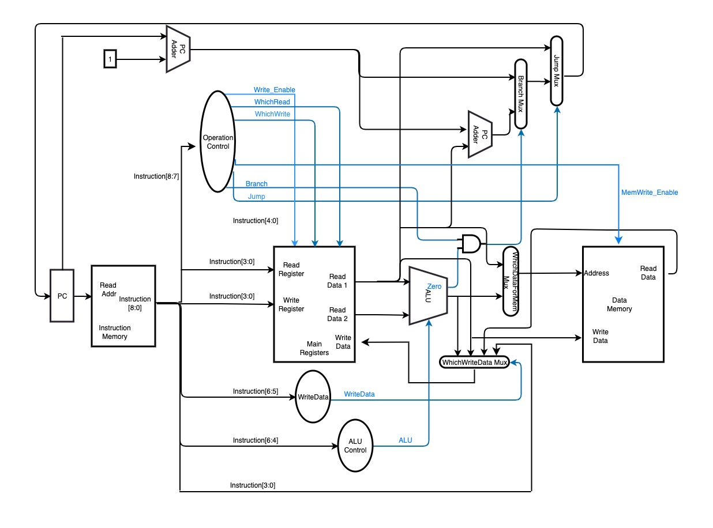
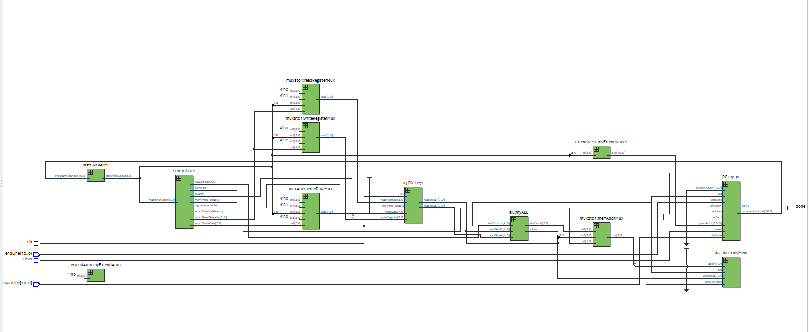
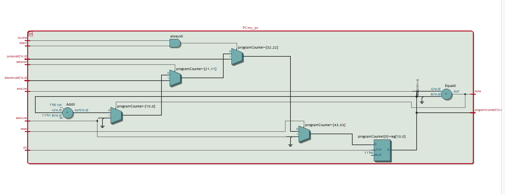
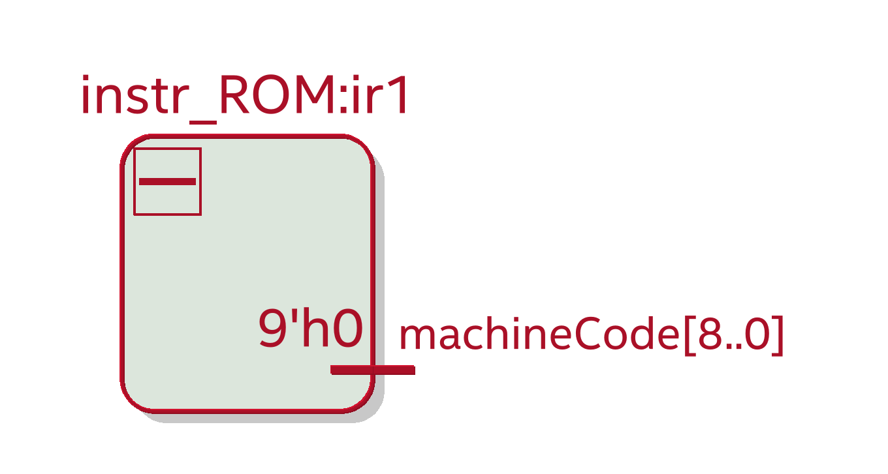
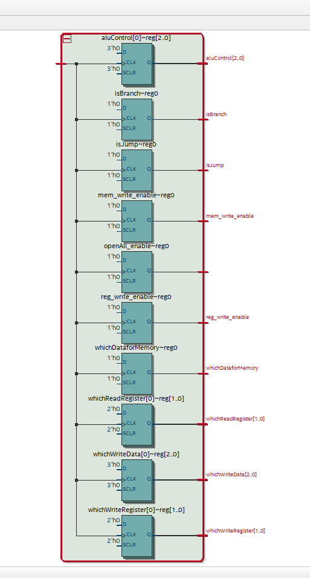
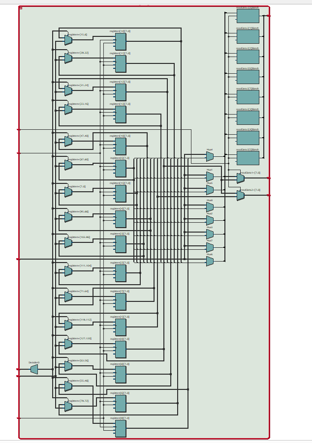
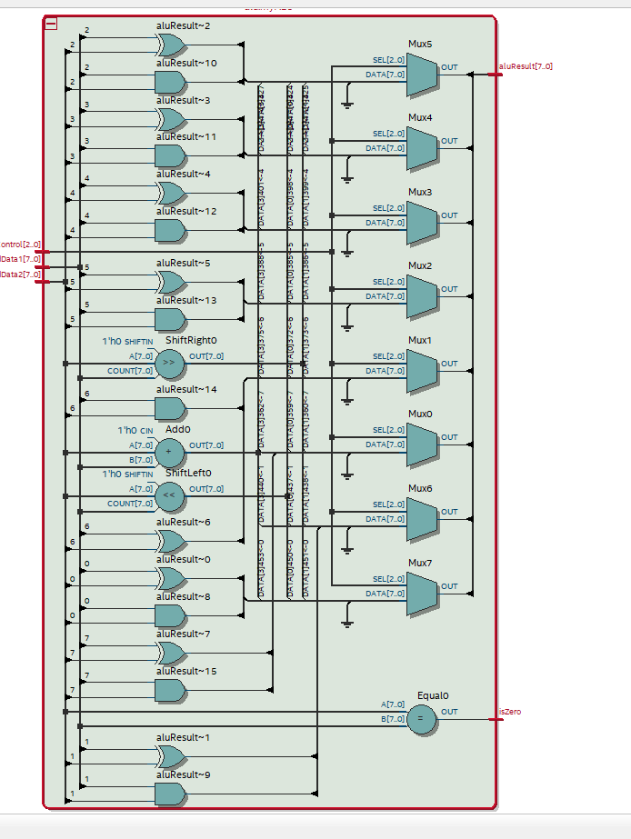
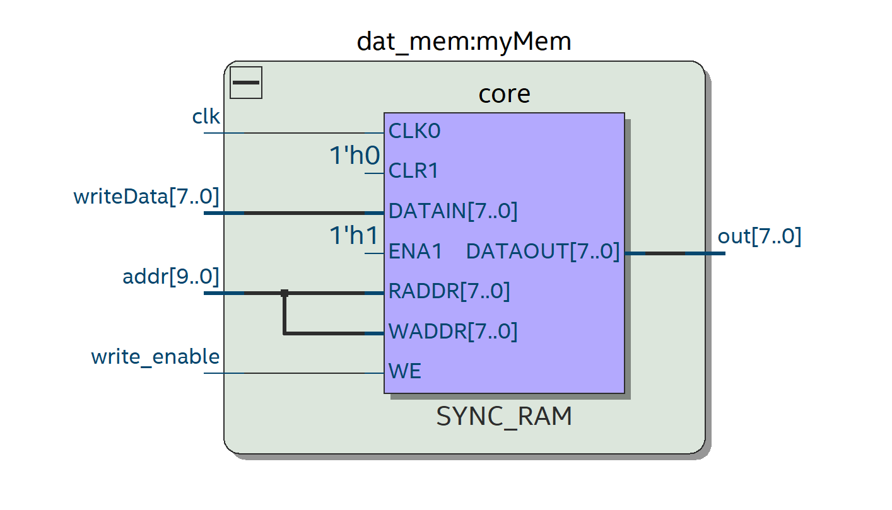
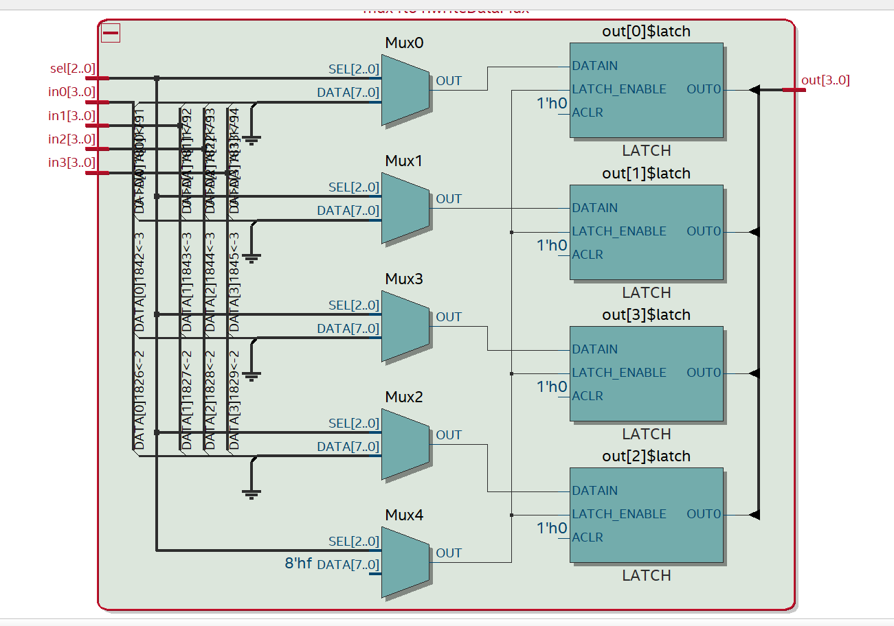

# CSE 141L Milestone 2
- Yiju Li, A16637309
- Haochen Wang, A17000549
- Sandy Wu, A16460868


## TOC
- [CSE 141L Milestone 2](#cse-141l-milestone-2)
  - [TOC](#toc)
  - [Academic Integrity](#academic-integrity)
  - [Team](#team)
  - [Introduction](#introduction)
  - [Architectural Overview](#architectural-overview)
  - [Machine Specification](#machine-specification)
  - [Programmer’s Model](#programmers-model)
  - [ALU Implementation](#alu-implementation)
  - [Individual Component Specification](#individual-component-specification)
  - [ASM to Machine Code](#asm-to-machine-code)
    - [ASM notice](#asm-notice)
    - [ASM to MachineCode](#asm-to-machinecode)
    - [Special ASM to MachineCode](#special-asm-to-machinecode)
    - [Supported ASMs](#supported-asms)
      - [ASM\_real](#asm_real)
      - [ASM\_super](#asm_super)
  - [Program Implementations](#program-implementations)
    - [Program 1](#program-1)
    - [Program 2](#program-2)
    - [Program 3](#program-3)
  - [Changelog](#changelog)

## Academic Integrity

> Your work will not be graded unless the signatures of all members of the group are present beneath the honor code.

> To uphold academic integrity, students shall:
Complete and submit academic work that is their own and that is an honest and fair representation of their knowledge and abilities at the time of submission.
Know and follow the standards of CSE 141L and UCSD.

> Please sign (type) your name(s) below the following statement:
I pledge to be fair to my classmates and instructors by completing all of my academic work with integrity. This means that I will respect the standards set by the instructor and institution, be responsible for the consequences of my choices, honestly represent my knowledge and abilities, and be a community member that others can trust to do the right thing even when no one is watching. I will always put learning before grades, and integrity before performance. I pledge to excel with integrity.

- Yiju Li
- Haochen Wang
- Sandy Wu


## Team

| Team Name      | Members                         |
| -------------- | ------------------------------- |
| The Three Body | Yiju Li, Haochen Wang, Sandy Wu |

## Introduction
- Machine Name
  - Wallfacer
  - The name comes from *The Three Body Problem*, a famous Sci-Fi.
- Machine type
  - Classical Load-Store
- Philosophy
  - "Wallfacer" is one of the most sensational character[s] in the Sci-Fi mentioned above. Similarly, our machine would be the most exhilarating machine designed for this course: Calm and Collected.
- Goals
  - The goals of our machine is solely to help our group to achieve A+ for this course.

## Architectural Overview


[//]: <> (To edit the picture above, simply download draw.io integration in VS code)

## Machine Specification
- Instruction formats and Operations
  - P(prepare)
    - Perparing for other instructions
    - Format: opcode(2 bits)+func(2 bit)+Operand1(1 bit)+Operand2(4 bits)
  - M(Memory)
    - All instructions related to memory
    - Format: opcode(2 bits)+func(3 bit)+operand1(4bits)
  - O(Operations)
    - Including Arithmetic/Logical/Shift instructions
    - Format: opcode(2 bits)+func(3 bit)+input(4 bits)
  - C(Counter)
    - Including all instructions related to modifing PC
    - Format: opcode(2 bits)+func(3 bit)+input(4 bits)
- Note our machine does not necessarily need to be seperated into these types. But for better scalability in the future, let's leave it as this.
  
  | Mnemonic | Meaning                                         | Type | opCode | func | Format     | Result                      |
  | -------- | ----------------------------------------------- | ---- | ------ | ---- | ---------- | --------------------------- |
  | hsd      | Set the value of holder directly                | P    | 00     | 00   | hsd 0 x    | R[h0] = x                   |
  | hsr      | Set the value of holder from the register       | P    | 00     | 01   | hsr 1 R[x] | R[h1] = R[x]                |
  | hsdu     | Set the upper value of holder directly          | P    | 00     | 10   | hsdu 0 x   | R[h0] = R[h0][3:0] + x<<4   |
  | ldh      | Load holder to reigister                        | P    | 00     | 11   | ldh 0 R[x] | R[x] = R[0]                 |
  | load     | Load with full address                          | M    | 01     | 000  | load R[x]  | R[x] = mem[ R[h0] ~ R[h1] ] |
  | save     | Save with full address                          | M    | 01     | 001  | save R[x]  | mem[ R[h0] ~ R[h1] ] = R[x] |
  | loadi    | Load with in-complete address                   | M    | 01     | 010  | loadi R[x] | R[x] = mem[ R[h0] ]         |
  | savei    | Save with in-complete address                   | M    | 01     | 011  | savei R[x] | mem[R[h0]] = R[x]           |
  | lss      | Left shift and save                             | O    | 10     | 000  | lss R[x]   | R[x] = R[x] << R[0]         |
  | rss      | Right shift and save                            | O    | 10     | 001  | rss R[x]   | R[x] = R[x] >> R[0]         |
  | xors     | Bitwise XOR and save                            | O    | 10     | 010  | xors R[x]  | R[x] = R[x] ^ R[0]          |
  | adds     | Add and save                                    | O    | 10     | 011  | adds R[x]  | R[x] = R[x] + R[0]          |
  | ands     | Bitwise AND and save                            | O    | 10     | 100  | ands R[x]  | R[x] = R[x] AND R[0]        |
  | jumpf    | Alter PC to some given value with fake absolute | C    | 11     | 000  | jumpf x    | PC = R[x]                   |
  | bne      | Branch if Not Equal                             | C    | 11     | 001  | bne x      | if R[0] != R[1], PC=R[x]    |
  | bl       | Branch if less                                  | C    | 11     | 010  | bl x       | if R[0] < R[1], PC = R[x]   |
  | bg       | Branch if greater                               | C    | 11     | 011  | bg  x      | if R[0] > R[1], PC = R[x]   |
  |          |                                                 |      |        |      |            |                             |
- Operands
  
  | Name | Number | Comment | 
  | --- | --- |---
  | Preparing Registers | 0,1 | --- | 
  |Zero Register | 2 | --- |
  | General Purpose Registers | 3-15| --- |
- Branch Operations
  
  There are three types of branching operation that is supported by our machine:
  - `bne`
  - `bl`
  - `bg`
  
  The address of these braches are calculated relatively, and the maximum distance supoorted is $2^5$ lines, currently.
- Addressing
  - Jump(Direct)
    - Enabled: Yes
    - Explanationn: Jump to abosolute address
    - Max. Distance: $2^{12}$ lines. 
  - branch(Immediate)
    - Enabled: Yes
    - Explanationn: Set PC to relative address
    - Max. Distance: $2^{5}$ lines. 
  - save/load(Direct)
    - Enabled: Yes
    - Explanationn: Jump to abosolute address
    - Max. Distance: $2^{8}$ lines. 
  - savei/loadi(Immediate)
    - Enabled: Yes
    - Explanationn: Jump to abosolute address
    - Max. Distance: $2^{5}$ lines. 

## Programmer’s Model
- The way of operation
    - Due to the limitations on the registers, our machine uses the "load-operations-save-load" model, meaning that we would recommend the programmer seperate the loading behaviours into different steps, instead of loading all the data at once. In other words, our machine requires the knowledge of how the data is structures before the operations.
  - One could compile the code from ARM/MIPS to Wallfacer(our machine) and vice versa. However, it won't work at all if one just simply copy the code. This is because that we implement with similar logic to ARM/MIPS but with different design, such that there's at most one operand for each instruction.

## ALU Implementation
- Our ALU only supports logical instructions, such as left shift, right shift, XOR, ADD, and AND, and will not be used for non-arithmetic instructions.

## Individual Component Specification
  - Top Level 
    - Module file name: top_level
    - Functioanlity Description: The top level module of our machine is responsible for creating connections between different submodules by designing and implementing necessary datapaths and control signals, serving as a primary interface between the submodules and the external environment. It coordinates the activities of different submodules to ensure that the machine functions as intended.
    - Schematic: 
  - Program Counter
    - Module file name: PC
    - Module testbench file name: pc_test
    - Functioanlity Description: The program counter module keeps track of the memory address where the next instruction of the program is stored, allowing the CPU to execute instructions in the right order. It also handles branch instructions, which can make the PC jump to a different part of the program.
    - (Optional) Testbench Description: TODO. Describe your testbench. How does it work? What test cases does it test?
    - Schematic: 
    - (Optional) Timing Diagram: TODO. Show us a screenshot of the timing diagram that demonstrates all relevant functions of  the fetch unit.
  - Instruction Memory
    - Module file name: instr_ROM
    - Functioanlity Description: The instruction memory module stores the program instructions in memory and provides them to the CPU as needed. When the CPU needs to execute an instruction, it requests it from the instruction memory module by specifying the address of the instruction in memory. The instruction memory module then reads the contents of that memory address and sends it to the CPU for execution.
    - Schematic: 
  - Control Decoder
    - Module file name: control
    - Functioanlity Description: The control decoder module receives the binary instruction code from the instruction register and decodes it into a set of control signals that direct the operation of the CPU's other functional units, such as the arithmetic logic unit (ALU), registers, and memory.
    - Schematic: 
  - Register File
    - Module file name: reg_file
    - Functioanlity Description: The register file module consists of 16 8-bit registers that can hold binary data temporarily during program execution. During program execution, data is loaded into the register file from memory or other sources, such as input/output devices. The CPU can then access the data in the register file very quickly without having to use slower memory storage.
    - Schematic: 
  - ALU (Arithmetic Logic Unit)
    - Module file name: alu
    - Module testbench file name: alu_Tb
    - Functioanlity Description: The ALU module performs arithmetic and logical operations on data that is stored in registers or memory. It receives instructions from the CPU control unit and operates on the data according to those instructions.
    - (Optional) Testbench Description: TODO. Describe your testbench. How does it work? What test cases does it test?
    - ALU Operations: We will be demonstrating "left shift and save"(lss), "right shift and save"(rss), "Bitwise XOR and save"(xors), "Add and save"(adds), and "Bitwise AND and save"(ands).
    - Schematic: 
    - (Optional) Timing Diagram: TODO. Show us a screenshot of the timing diagram that demonstrates all relevant functions of  the fetch unit.
  - Data Memory
    - Module file name: dat_mem
    - Functioanlity Description: The data memory module is designed to hold data temporarily or permanently so that it can be accessed by the processor when needed. When the processor needs to read or write data, it sends the address of the memory cell to the data memory module, which then retrieves or stores the data at that location. 
    - Schematic: 
  - Muxes (Multiplexers)
    - Module file name: mux
    - Functioanlity Description: The muxes module selects one input signal from four input signals based on the value of the control signal. The selected input signal is then passed through to the output of the module.
    - Schematic: 

## ASM to Machine Code
### ASM notice
Because our special design of the ISA, some operations are more complex than the normal ones:
- ASM Example - Add: `R[x] = R[x] + R[y]`:
  - MIPS: `add $x, $x, $y`
  - Ours: `hsr 0 $y`, `adds $x`
- ASM Example - Add intermidiate: `R[x] = R[x] + imm`
  - MIPS: `add $x, $x, imm`
  - Ours: `hsd 0 imm`, `adds $x`
- Jump Example - jump: PC = DEST
  - MIPS: `jump DEST`
  - Ours: `SETl DEST`, `SETu DEST`, `jump`
- Brach Example - bne: `if R[x] != R[y]: PC = DEST`
  - MIPS: `bne $x, $y, DEST`
  - Ours: `ldh 0 $x`, `ldh 1 $y`, `SETl DEST`, `SETu DEST`, `Setb`, `bne`

### ASM to MachineCode

| Mnemonic | Meaning                                   | Type | opCode | func | Format     | Result                      |
| -------- | ----------------------------------------- | ---- | ------ | ---- | ---------- | --------------------------- |
| hsd      | Set the value of holder directly          | P    | 00     | 00   | hsd 0 x    | R[h0] = x                   |
| hsr      | Set the value of holder from the register | P    | 00     | 01   | hsr 1 R[x] | R[h1] = R[x]                |
| hsdu     | Set the upper value of holder directly    | P    | 00     | 10   | hsdu 0 x   | R[h0] = R[h0][3:0] + x<<4   |
| ldh      | Load holder to reigister                  | P    | 00     | 11   | ldh 0 R[x] | R[x] = R[0]                 |
| load     | Load with full address                    | M    | 01     | 000  | load R[x]  | R[x] = mem[ R[h0] ~ R[h1] ] |
| save     | Save with full address                    | M    | 01     | 001  | save R[x]  | mem[ R[h0] ~ R[h1] ] = R[x] |
| loadi    | Load with in-complete address             | M    | 01     | 010  | loadi R[x] | R[x] = mem[ R[h0] ]         |
| savei    | Save with in-complete address             | M    | 01     | 011  | savei R[x] | mem[R[h0]] = R[x]           |
| lss      | Left shift and save                       | O    | 10     | 000  | lss R[x]   | R[x] = R[x] << R[0]         |
| rss      | Right shift and save                      | O    | 10     | 001  | rss R[x]   | R[x] = R[x] >> R[0]         |
| pars     | Parity bit and save                      | O    | 10     | 010  | pars R[x]  | R[x] = {7'b00000000, ^{R[x], R[0]}}          |
| adds     | Add and save                              | O    | 10     | 011  | adds R[x]  | R[x] = R[x] + R[0]          |
| ands     | Bitwise AND and save                      | O    | 10     | 100  | ands R[x]  | R[x] = R[x] AND R[0]        |
| ors     | Bitwise OR and save                      | O    | 10     | 101  | ors R[x]  | R[x] = R[x] OR R[0]        |
| xors     | Bitwise XOR and save                      | O    | 10     | 110  | xors R[x]  | R[x] = R[x] ^ R[0]          |
| jump     | Alter PC to value in selected register    | C    | 11     | 000  | jumpf x    | PC = R[x]                   |
| bne      | Branch if Not Equal                       | C    | 11     | 001  | bne x      | if R[0] != R[1], PC=R[x]    |
| bl       | Branch if less                            | C    | 11     | 010  | bl x       | if R[0] < R[1], PC = R[x]   |
| bg       | Branch if greater                         | C    | 11     | 011  | bg  x      | if R[0] > R[1], PC = R[x]   |
 | beq      | Branch if Equal                                 | C    | 11     | 100  | bne x      | if R[0] == R[1], PC=R[x]    |

### Special ASM to MachineCode

| Mnemonic | Meaning                               | Format    | ASM CODE         | Result                    |
| -------- | ------------------------------------- | --------- | ---------------- | ------------------------- |
| SETl     | Set the lower part of the PC register | SETl DEST | hsd 0 DEST[3:0]  | R[0] = DEST[3:0]          |
| SETu     | Set the upper part of the PC register | SETu DEST | hsdu 0 DEST[7:4] | R[0] = DEST[7:4]          |
| SETb     | Move data from R[0] to  R[2]          | SETb      | ldh 0 2          | R[2] = R[0]               |
| jump     | jump with no select register          | jumpf     | jumpf 0          | PC = R[0]                 |
| bne      | bne with no select register           | bne       | bne 2            | if R[0] != R[1], PC=R[2]  |
| bl       | bl with no select register            | bl        | bl 2             | if R[0] < R[1], PC = R[2] |
| bg       | bg with no select register            | bg        | bg 2             | if R[0] > R[1], PC = R[2] |
| beq      | bg with no select register            | bg        | bg 2             | if R[0] == R[1], PC = R[2] |

### Supported ASMs
Note: 
- You need to write `$x` or `x` to express the xth register;
- You need to write `&LINENUMBER&` to correctly define the line number;

#### ASM_real
All above ASMs are supported by our assemblr, plus some ASM_super codes below;

#### ASM_super
**ASM_super can generate multiple ASM_real, where ASM_real is 1-1 of the machine code**

| Format                   | ASM_real CODE                                                    |
| ------------------------ | ---------------------------------------------------------------- |
| add R[x] R[y] R[z]       | `hsr 0 $y`, `ldh 0 $x`, `hsr 0 $z`, `adds $x`                    |
| add R[x] R[x] R[y]       | `hsr 0 $y`,               `adds $x`                              |
| add R[x] R[y]            | `hsr 0 $y`,               `adds $x`                              |
| addi R[x] R[y] z         | `hsr 0 $y`, `ldh 0 $x`, `hsd 0 z`, `adds $x`                     |
| addi R[x] R[x] y         | `hsd 0 y`,               `adds $x`                               |
| addi R[x] y              | `hsd 0 y`,               `adds $x`                               |
| par R[x] R[y] R[z]       | `hsr 0 $y`, `ldh 0 $x`, `hsr 0 $z`, `xors $x`                    |
| par R[x] R[x] R[y]       | `hsr 0 $y`,               `xors $x`                              |
| par R[x]  R[y]           | `hsr 0 $y`,               `xors $x`                              |
| pari R[x] R[y] z         | `hsr 0 $y`, `ldh 0 $x`, `hsd 0 z`, `xors $x`                     |
| pari R[x] R[x] y         | `hsd 0 y`,               `xors $x`                               |
| pari R[x]  y             | `hsd 0 y`,               `xors $x`                               |
| xor R[x] R[y] R[z]       | `hsr 0 $y`, `ldh 0 $x`, `hsr 0 $z`, `xors $x`                    |
| xor R[x] R[x] R[y]       | `hsr 0 $y`,               `xors $x`                              |
| xor R[x]  R[y]           | `hsr 0 $y`,               `xors $x`                              |
| xori R[x] R[y] z         | `hsr 0 $y`, `ldh 0 $x`, `hsd 0 z`, `xors $x`                     |
| xori R[x] R[x] y         | `hsd 0 y`,               `xors $x`                               |
| xori R[x]  y             | `hsd 0 y`,               `xors $x`                               |
| and R[x] R[y] R[z]       | `hsr 0 $y`, `ldh 0 $x`, `hsr 0 $z`, `ands $x`                    |
| and R[x] R[x] R[y]       | `hsr 0 $y`,               `ands $x`                              |
| and R[x] R[y]            | `hsr 0 $y`,               `ands $x`                              |
| andi R[x] R[y] z         | `hsr 0 $y`, `ldh 0 $x`, `hsd 0 z`, `ands $x`                     |
| andi R[x] R[x] y         | `hsd 0 y`,               `ands $x`                               |
| andi R[x]  y             | `hsd 0 y`,               `ands $x`                               |
| or R[x] R[y] R[z]       | `hsr 0 $y`, `ldh 0 $x`, `hsr 0 $z`, `ands $x`                    |
| or R[x] R[x] R[y]       | `hsr 0 $y`,               `ands $x`                              |
| or R[x] R[y]            | `hsr 0 $y`,               `ands $x`                              |
| ori R[x] R[y] z         | `hsr 0 $y`, `ldh 0 $x`, `hsd 0 z`, `ands $x`                     |
| ori R[x] R[x] y         | `hsd 0 y`,               `ands $x`                               |
| ori R[x]  y             | `hsd 0 y`,               `ands $x`                               |
| ls R[x] R[y] R[z]        | `hsr 0 $y`, `ldh 0 $x`, `hsr 0 $z`, `lss $x`                     |
| ls R[x] R[x] R[y]        | `hsr 0 $y`,               `lss $x`                               |
| ls R[x]  R[y]            | `hsr 0 $y`,               `lss $x`                               |
| lsi R[x] R[y] z          | `hsr 0 $y`, `ldh 0 $x`, `hsd 0 z`, `lss $x`                      |
| lsi R[x] R[x] y          | `hsd 0 y`,               `lss $x`                                |
| lsi R[x]  y              | `hsd 0 y`,               `lss $x`                                |
| rs R[x] R[y] R[z]        | `hsr 0 $y`, `ldh 0 $x`, `hsr 0 $z`, `rss $x`                     |
| rs R[x] R[x] R[y]        | `hsr 0 $y`,               `rss $x`                               |
| rs R[x]  R[y]            | `hsr 0 $y`,               `rss $x`                               |
| rsi R[x] R[y] z          | `hsr 0 $y`, `ldh 0 $x`, `hsd 0 z`, `rss $x`                      |
| rsi R[x] R[x] y          | `hsd 0 y`,               `rss $x`                                |
| rsi R[x]  y              | `hsd 0 y`,               `rss $x`                                |
| super_jump DEST          | `SETl DEST`, `SETu DEST`, `jump`                                 |
| super_bne R[x] R[y] DEST | `SETl DEST`, `SETu DEST`, `Setb`, `hsr 0 $x`, `hsr 1 $y`, `bne ` |
| super_bl R[x] R[y] DEST  | `SETl DEST`, `SETu DEST`, `Setb`, `hsr 0 $x`, `hsr 1 $y`, `bl `  |
| super_bg R[x] R[y] DEST  | `SETl DEST`, `SETu DEST`, `Setb`, `hsr 0 $x`, `hsr 1 $y`, `bg `  |
| super_beq R[x] R[y] DEST | `SETl DEST`, `SETu DEST`, `Setb`, `hsr 0 $x`, `hsr 1 $y`, `bne ` |
| super_bne_i R[x] y DEST  | `SETl DEST`, `SETu DEST`, `Setb`, `hsr 0 $x`, `hsd 1 y`, `bne `  |
| super_bl_i R[x] y DEST   | `SETl DEST`, `SETu DEST`, `Setb`, `hsr 0 $x`, `hsd 1 y`, `bl `   |
| super_bg_i R[x] y DEST   | `SETl DEST`, `SETu DEST`, `Setb`, `hsr 0 $x`, `hsd 1 y`, `bg `   |
| super_beq_i R[x] y DEST  | `SETl DEST`, `SETu DEST`, `Setb`, `hsr 0 $x`, `hsd 1 y`, `bne `  |
| super_load R[x] DEST     | `Setl DESR`,   `SETu DEST`,       `loadi $x`                     |
| super_save R[x] DEST     | `Setl DESR`,   `SETu DEST`,       `savei $x`                     |


## Program Implementations
### Program 1
```python
program1():
  for i in range(15):
    word = mem[i*2]+mem[i*2+1][:3]
    p8 = ^(word[4:11])
    P4 = ^(word[7:11])^(word[1:5])
    P4 = ^(word[9:11])^(word[5:7])^word[3]^word[2]^word[1]
    p2 = word[0]^word[2]^word[3]^word[5]^word[6]^[9]^[10]
    p1 = word[0]^word[1]^word[3]^word[4]^word[6]^[8]^[10]
    p0 = ^(word)^p1^p2^p3^p4^p8
    mem[i*2+30] = [p0]+[p1]+[p2] + word[0]+[p4] + word[1:4]
    mem[i*2+31] = [p8]+ word[4:11]
```
```asm
      hclr            
      ldh          0   $15 
LOOP  hsr          0   $15   
      hsd          1   30    
      bl DONE           

      hsr          0   $15
      loadi        $14 
      hsd          1   1
      adds         $15

      hsr          0   $15
      loadi        $13    
      hclr            
      ldh          0   $12   
      ldh          0   $11   
      ldh          0   $10   
      ldh          0   $9    
      ldh          0   $8
      ldh          0   $6

      //D11
      hsr          0   $13   
      ldh          0   $7    
      hsd          2    
      rss          $7    
      hsr          0   $7    
      xors         $12
      xors         $11
      xors         $10
      xors         $9
      xors         $8
      hsr          0   $7
      adds         $6
      hsd          1
      lss          $6

      //D10
      hsr          0   $13   
      ldh          0   $7    
      hsd          1    
      rss          $7    
      hsr          0   $7    
      xors         $12
      xors         $11
      xors         $10
      xors         $8
      hsr          0   $7
      adds         $6
      hsd          1
      lss          $6

      //D9
      hsr          0   $13   
      ldh          0   $7    
      hsd          0    
      rss          $7    
      hsr          0   $7    
      xors         $12
      xors         $11
      xors         $9
      xors         $8
      hsr          0   $7
      adds         $6
      hsd          1
      lss          $6

      //D8
      hsr          0   $14   
      ldh          0   $7    
      hsd          7    
      rss          $7    
      hsr          0   $7    
      xors         $12
      xors         $11
      xors         $8
      hsr          0   $7
      adds         $6
      hsd          1
      lss          $6

      //D7
      hsr          0   $14   
      ldh          0   $7    
      hsd          6    
      rss          $7
      hsd          0   1
      ands         $7    
      hsr          0   $7    
      xors         $12
      xors         $10
      xors         $9
      xors         $8
      hsr          0   $7
      adds         $6
      hsd          1
      lss          $6

      //D6
      hsr          0   $14   
      ldh          0   $7    
      hsd          5    
      rss          $7 
      hsd          0   1
      ands         $7    
      hsr          0   $7    
      xors         $12
      xors         $10
      xors         $8
      hsr          0   $7
      adds         $6
      hsd          1
      lss          $6

      //D5
      hsr          0   $14   
      ldh          0   $7    
      hsd          4    
      rss          $7 
      hsd          0   1
      ands         $7    
      hsr          0   $7    
      xors         $12
      xors         $9
      xors         $8
      hsr          0   $7
      adds         $6
      hsd          1
      lss          $6

      //p8 and save first byte
      hsr          0   $12
      adds         $6
      hsr          1   $15
      hsd          0   30
      adds         $1
      hsr          0   $1
      savei        $6

      //D4
      hclr         
      ldh          $6
      hsr          0   $14   
      ldh          0   $7    
      hsd          3    
      rss          $7 
      hsd          0   1
      ands         $7    
      hsr          0   $7    
      xors         $11
      xors         $10
      xors         $9
      xors         $8
      hsr          0   $7
      adds         $6
      hsd          1
      lss          $6

      //D3
      hsr          0   $14   
      ldh          0   $7    
      hsd          2    
      rss          $7 
      hsd          0   1
      ands         $7    
      hsr          0   $7    
      xors         $12
      xors         $10
      xors         $8
      hsr          0   $7
      adds         $6
      hsd          1
      lss          $6

      //D2
      hsr          0   $14   
      ldh          0   $7    
      hsd          1    
      rss          $7 
      hsd          0   1
      ands         $7    
      hsr          0   $7    
      xors         $11
      xors         $9
      xors         $8
      hsr          0   $7
      adds         $6
      hsd          1
      lss          $6

      //p4
      hsr          0   $11
      adds         $6
      hsd          1
      lss          $6


      //D1
      hsr          0   $14   
      ldh          0   $7    
      hsd          0    
      rss          $7 
      hsd          0   1
      ands         $7    
      hsr          0   $7    
      xors         $10
      xors         $9
      xors         $8
      hsr          0   $7
      adds         $6
      hsd          1
      lss          $6

      //p2
      hsr          0   $10
      adds         $6
      hsd          1
      lss          $6

      //p1
      //p4
      hsr          0   $9
      adds         $6
      hsd          1
      lss          $6

      hsr          0    $10
      xors         $8
      hsr          0    $9
      xors         $8
      hsr          0   $8
      adds         $6

      hsr          1   $15
      hsd          0   29
      adds         $1
      hsr          0   $1
      savei        $6

      hsd          0   1
      adds         $15
      jump LOOP          
DONE
```
### Program 2
```C
for i in range(15):
    MSW = mem[31 + i];
    LSW = mem[30 + i];
    p8 = MSW & 1;
    p4 = (LSW >> 4) & 1;
    p2 = (LSW >> 2) & 1;
    p1 = (LSW >> 1) & 1;
    p0 = LSW & 1;

    b11_b9 = (MSW >> 5) & 7 ;
    b8_b5 = (MSW >> 1) & 15;
    b8_b1 = (b8_b5 << 4) | ((LSW & 224) >> 4) | ((LSW & 8) >> 3);

    if (b11_b9 ^ b8_b5 != p8) {
        F = 1;
    }
    else {
        if (^(b11_b9, b8_b1 & 142) != p4) {
            F = 2;
        }
        if (^(b11_b9 & 6, b8_b1 & 109) != p2) {
            F = 2;
        }
        if (^(b11_b9 & 5, b8_b1 & 91) != p1) {
            F = 2;
        }
        if (^(b11_b9, b8_b1, p8, p4, p2, p1) != p0) {
            F = 2;
        }
    }

    mem[i * 2] = b8_b1;
    mem[i * 2 + 1] = F << 7 | b11_b9;
```
```asm
hsd 0 0
ldh 0 3
hsd 0 5
hsdu 0 11
ldh 0 5
hsr 0 3
hsd 1 14
bg 5
hsd 0 15
hsdu 0 1
ldh 0 5
hsd 0 14
hsdu 0 1
ldh 0 6
hsr 0 3
adds 5
hsr 0 5
loadi 5
hsr 0 3
adds 6
hsr 0 6
loadi 6
hsr 0 5
ldh 0 7
hsd 0 1
ands 7
hsr 0 6
ldh 0 8
hsd 0 4
rss 8
hsd 0 1
ands 8
hsr 0 6
ldh 0 9
hsd 0 2
rss 9
hsd 0 1
ands 9
hsr 0 6
ldh 0 10
hsd 0 1
rss 10
hsd 0 1
ands 10
hsr 0 6
ldh 0 11
hsd 0 1
ands 11
hsr 0 5
ldh 0 12
hsd 0 5
rss 12
hsd 0 7
ands 12
hsr 0 5
ldh 0 13
hsd 0 1
rss 13
hsd 0 15
ands 13
hsr 0 13
ldh 0 14
hsd 0 4
lss 14
hsd 0 0
hsdu 0 14
hsr 1 6
ands 1
hsd 0 4
rss 1
ldh 1 15
hsr 0 14
ands 1
xors 15
hsr 0 1
xors 15
hsr 0 15
ldh 0 14
hsd 0 8
hsr 1 6
ands 1
hsd 0 3
rss 1
ldh 1 15
hsr 0 14
ands 1
xors 15
hsr 0 1
xors 15
hsr 0 15
ldh 0 14
hsd 0 10
hsdu 0 9
ldh 0 5
hsr 0 13
hsr 1 12
xors 1
hsr 0 7
bne 5
hsd 0 13
hsdu 0 9
ldh 0 6
hsd 0 14
hsdu 0 8
hsr 1 14
ands 1
hsr 0 12
xors 1
hsr 0 8
bne 6
hsd 0 6
hsr 1 12
ands 1
hsd 0 13
hsdu 0 6
ldh 0 15
hsr 0 14
ands 15
hsr 0 15
xors 1
hsr 0 9
bne 6
hsd 0 5
hsr 1 12
ands 1
hsd 0 11
hsdu 0 5
ldh 0 15
hsr 0 14
ands 15
hsr 0 15
xors 1
hsr 0 10
bne 6
hsr 0 12
hsr 1 14
xors 1
hsr 0 7
xors 1
hsr 0 8
xors 1
hsr 0 9
xors 1
hsr 0 10
xors 1
hsr 0 11
bne 6
hsd 0 0
ldh 0 15
hsd 0 15 
hsdu 0 9
ldh 0 5
jump 5
hsd 0 1 
ldh 0 15
jump 5
hsd 0 2 
ldh 0 15
hsd 0 1
hsr 1 3
lss 1
hsr 0 1
savei 14
hsd 0 1
adds 1
ldh 1 5
hsd 0 7
lss 15
hsr 1 15
hsr 0 12
ands 15
xors 1
hsr 0 15
xors 1
hsr 0 5
savei 1
hsd 0 1
adds 3
hsd 0 3
jump 0
```

### Program 3
```C
int program3(mem[32][8],pattern[8])
{
    int count = 0,byteCount=0,intersectCount=0;
    int flag=0;
    int i,j,k;

    for (i=0;i<32;i++) {
        for(j=0;j<8-5+1;j++){
            for (k=0;k<5;k++) {
                if(mem[i][j+k] != pattern[k]) 
                    break; 
            }
            if (k == 5){ 
                count++;
                flag=1;
            }
        }
        byteCount+=flag;
        flag=0;
    }
    for (i=0;i<31;i++) {
        for(j=0;j<8-5+1;j++){
            for (k=0;k<5;k++) {
                if((mem[i][4,7]+mem[i+1][0,3])[j+k] != pattern[k]) 
                    break; 
            }
            if (k == 5){ 
                intersectCount++; 
            }
        }
    }
    mem[33]=count;
    mem[34]=byteCount;
    mem[35]=count+intersectCount;
    
}
```
```
// count=$12=0
// byteCount=$13=0
// intersectCount=$14=0
// flag=$15=0

// i=$3=0
// loopi: 
// if i>31:go to loopiend

// j=$4=0
// loopj: 
// if j>3:go to loopjend

// k=$5=0
// loopk:
// if k>4:go to loopkend

// $6 = mem[i]
// $7 = pattern
// $8 = 8b1000_0000 >> j
// $9 = $8 >> k
// $10 = $6 & $9
// $11 = $7 & $8
// $0 = $10
// $1 = $11
// if $0!=$1: go to loopkend
// k+=1
// go to loopk
// loopkend:

// j+=1
// if k!=5: go to loopj
// count+=1
// flag=1
// go to loopj
// loopjend:

// byteCount+=flag;
// flag=0;
// i+=1
// go to loopi
// loopiend:

// mem[35]=count=$11
// mem[34]=byteCount=$12

// first loop ends
////////////////////////////////////////////////////////////////
// second loop begins

// i=$3=0
// loopi: 
// if i>30:go to loopiend

// j=$4=0
// loopj: 
// if j>3:go to loopjend

// k=$5=0
// loopk:
// if k>4:go to loopkend

// $6 = mem[i] << 4
// $7 = mem[i+1] >> 4
// $6 = $6 + $7
// $7 = pattern
// $8 = 8b1000_0000 >> j
// $9 = $8 >> k
// $10 = $6 & $9
// $11 = $7 & $8
// $0 = $10
// $1 = $11
// if $0!=$1: go to loopkend
// k+=1
// go to loopk
// loopkend:

// j+=1
// if k!=5: go to loopj
// intersectCount+=1
// go to loopj
// loopjend:

// i+=1
// go to loopi
// loopiend:

// mem[35]=count+intersectCount
```

```asm
; count=$12=0:
hsd 12 0
; byteCount=$13=0
hsd 13 0
; intersectCount=$14=0
hsd 14 0
; flag=$15=0
hsd 15 0     

; i=$3=0:
hsd 3 0
; loopi:            
Label: loopi
; if i>31:go to end
hsd 1 31
hsr 0 3
bg end

; j=$4=0:
hsd 4 0            
; loopj:            
Label: loopj
; if j>3:go to loopjend
hsd 1 3
hsr 0 4
bg loopjend

; k=$5=0
hsd 5 0
; loopk:
Label: loopk
; if k>4:go to loopkend
hsd 1 4
hsr 0 5
bg loopkend

; $6=mem[i]
hsr 0 3            
loadi 6          
; $7=pattern
hsd 0 32          
loadi 7         
; $8 = 8b1000_0000 >> j
hsd 8 128 ;==8b1000_0000
hsr 0 $4 
rss $8
; $9 = $8 >> k
hsr 9 8
hsr 0 5
rss $9   
; $10 = $6 & $9
hsr 10 6 
hsr 0 9 
ands 10  
; $11 = $7 & $8
hsr 11 8 
hsr 0 7 
ands 11  
; $0=$10
hsr 0 10
; $1=$11
hsr 1 11
; if $0!=$1: go to loopkend
bne loopkend

; k+=1
hsd 0 1           
adds 5
; go to loopk
jumpf loopk
; loopkend:
Label:loopkend

; j+=1
hsd 0 1           
adds 4
; if k!=5: go to loopj
hsd 0 5
hsr 1 5
bne loopj
; count+=1
hsd 0 1           
adds 12
; flag=1
hsd 15 1
; go to loopj
jumpf loopj
; loopjend:
Label:loopjend

; byteCount+=flag;
hsr 0 15
adds 13
; flag=0;
hsd 15 0
; i+=1:
hsd 0 1            
adds 3          
; go to loopi
jumpf loopi
; loopiend:
Label:loopiend

; mem[33]=count
hsd 0 33
savei 12
; mem[34]=byteCount
hsd 0 34
savei 13

; first loop ends
////////////////////////////////////////////////////////////////
; second loop begins

; count=$12=0:
hsd 12 0
; byteCount=$13=0
hsd 13 0
; intersectCount=$14=0
hsd 14 0
; flag=$15=0
hsd 15 0     

; i=$3=0:
hsd 3 0
; loopi:            
Label: loopi
; if i>31:go to end
hsd 1 31
hsr 0 3
bg end

; j=$4=0:
hsd 4 0            
; loopj:            
Label: loopj
; if j>3:go to loopjend
hsd 1 3
hsr 0 4
bg loopjend

; k=$5=0
hsd 5 0
; loopk:
Label: loopk
; if k>4:go to loopkend
hsd 1 4
hsr 0 5
bg loopkend

; $6=mem[i]
hsr 0 3            
loadi 6       
; $7 = mem[i+1]
hsr 1 3
hsd 0 1
adds 1
loadi 7
; $6 = $6 << 4
; $7 = $7 >> 4
hsd 0 4
lss $6
rss $7
; $6 = $6 + $7
hsr 0 7
adds 6   
; $7=pattern
hsd 0 32          
loadi 7         
; $8 = 8b1000_0000 >> j
hsd 8 128 ;==8b1000_0000
hsr 0 $4 
rss $8
; $9 = $8 >> k
hsr 9 8
hsr 0 5
rss $9   
; $10 = $6 & $9
hsr 10 6 
hsr 0 9 
ands 10  
; $11 = $7 & $8
hsr 11 8 
hsr 0 7 
ands 11  
; $0=$10
hsr 0 10
; $1=$11
hsr 1 11
; if $0!=$1: go to loopkend
bne loopkend

; k+=1
hsd 0 1           
adds 5
; go to loopk
jumpf loopk
; loopkend:
Label:loopkend

; j+=1
hsd 0 1           
adds 4
; if k!=5: go to loopj
hsd 0 5
hsr 1 5
bne loopj
; intersectCount+=1
hsd 0 1           
adds 14
; go to loopj
jumpf loopj
; loopjend:
Label:loopjend

; i+=1:
hsd 0 1            
adds 3          
; go to loopi
jumpf loopi
; loopiend:
Label:loopiend

; mem[35]=count+intersectCount
hsr 0 12
adds 14
hsd 0 35 
savei 14
```

```python
def program3():
  def next(location,index): #in-place modifying
    if (index == 7):
      index = 0
      location += 1
    else:
      index += 1
  
  int location = 0
  int index = 0
  int count = 0, byteCount=0, fullCount=0

  pattern = mem[32][3:7]
  byteCountEnabled = True
  while(location !=31 or index !=4):
    if(pattern[0] == mem[location][index]):
      currLoc = location # shallow copy
      currInd = index
      for i in range(1,5):
        if (i == 5):
          fullCount += 1
          if(location == currLoc):
            count+=1
            if(byteCountEnabled):
              byteCount += 1
              byteCountEnabled = False
        next(currLoc,currInd)
        if(pattern[i] != mem[currLoc][currInd]):
          break
    currLoc = location
    next(location,index)
    if(currLoc != location):
      byteCountEnabled = True
  
  mem[33] = count
  mem[34] = byteCount
  mem[35] = fullCount

```

## Changelog
  - Milestone 2
    - Architecture Overview
      - Included labels for wires
      - Updated to a more clear and precise diagram
  - Milestone 1
    - Initial version

