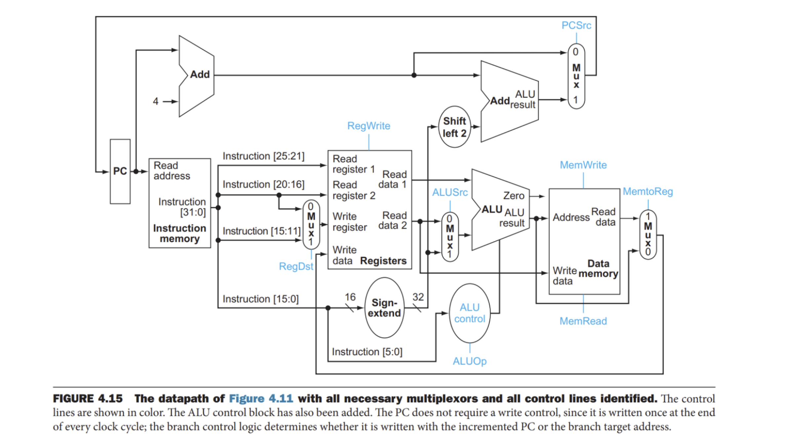
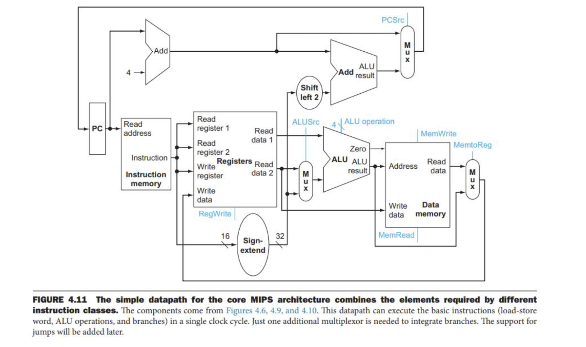
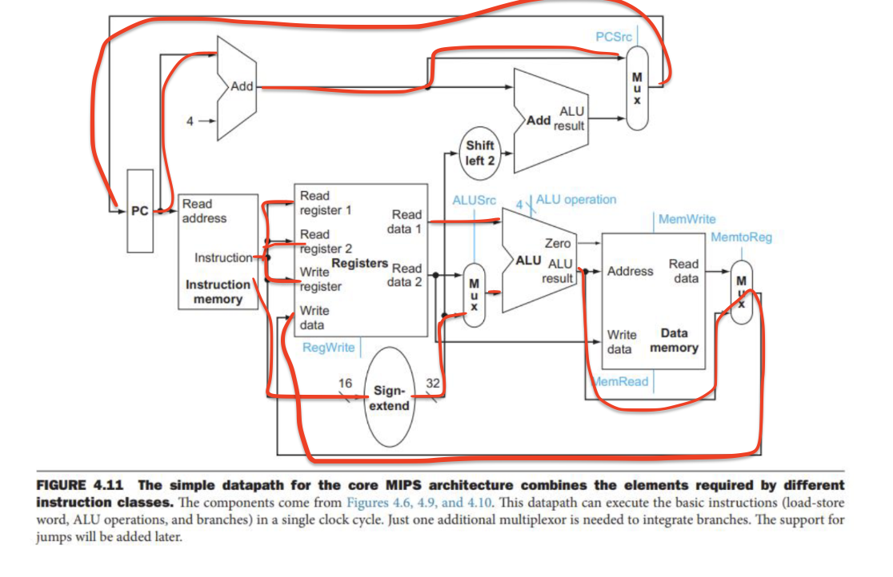

# CSE 141: Homework #3 

*Due: February 9, Thursday by 11:59pm on Gradescope*

- *Please either type in or if handwritten, make your answers as neat as possible.*  
- *Enter your answers completely in the text box right below the question. Answers that appear outside of the box might not be graded.*

**To grader: I am trying to make this answer fit the original document. However, I am not abble to edit the PDF version, while the answering boxed in the docx version is not well-arranged. I tried to open the docx version in google docs; macOS Pages and even the MS Word on my MacOS. None of them gave me the answeing boxes in the right place. Therefore I made this new docuemnt with similar format to the original file and I will handwrite in my ipad for the future assignments.**

> Q1. For a given program 60% of the executed instructions are arithmetic instructions, 20% are load stores and the rest are branch instructions. Assume a multicycle machine where arithmetic instructions take 2 cycles, load-store instruction takes 5 cycles and branch instruction takes 3 cycles. If we need speedup of 1.2 in overall performance just by improving arithmetic instructions, how many cycles should arithmetic instruction take? 

Auume the total number of instructions executed by this machine is $$1$$. And thus the total number of cycles needed to perform the instructions are $$0.6*2+0.2*5+0.2*3 = 2.8$$. Therefore the cycles that arithmetic instruction takes to make the $$1.2$$ speed up would be:

$$
(\frac{2.8}{1.2}-0.2*5-0.2*3)/0.6 = 1.22
$$

> Q2.  Convert 100 and 42 to unsigned 8-bit binary numbers and show the calculation 100 + 42.  Is there an overflow?  If we did the same for 8-bit twos complement, would there be overflow? 

$$(100)_{10} = (01100100)_2$$ and $$(42)_{10} = (00101010)_2$$. And the calculation is:

$$
\begin{equation*}\begin{array}{c}
\phantom{+}01100100\\
\underline{+00101010}\\
\phantom{+}10001110
\end{array}\end{equation*}
$$

And in 2's complement we have: $$(100)_{10} = (01100100)_2$$ and $$(42)_{10} = (00101010)_2$$. And the calculation is:

$$
\begin{equation*}\begin{array}{c}
\phantom{+}01100100\\
\underline{+00101010}\\
\phantom{+}10001110\\
=-114_{10}\\
\end{array}\end{equation*}
$$

Summary: there's no overflow for the unsigned binaries to do the addtion, but overflow occurs with 2's complement.

> Q3.  Convert -141 and 117 to 10-bit twos complement numbers and show the calculation of 117 - 141 

In 2's complement we have: $$(-141)_{10} = (1101110011)_2$$ and $$(117)_{10} = (0001110101)_2$$. And the calculation is:

$$
\begin{equation*}\begin{array}{c}
\phantom{+}1101110011\\
\underline{+0001110101}\\
\phantom{+}1111101000\\
=-24_{10}\\
\end{array}\end{equation*}
$$

> Q4. The ALU from class supports 5 operations (and, or, add, subtract, set-on-less-than), so 3 bits is enough to distinguish those 5 operations.  If we were to support a larger portion of the MIPS ISA (adding logical shift left, logical shift right, nor) how many control bits would you need for the ALU?  Justify your answer. 

The number of total operations required by the ALU is $$5+3=8$$ and therefore we need $$\lceil\log_28\rceil = 3 $$

> Q5.  For the instruction `ADDU $rd, $rs, $rt`, what are the values of the control signals generated in Fig 4.15(textbook). 
> 

| control | value |
| --- | --- |
|PCsrc | 0(PC + 4)|
|RegWrite | 1(True) |
|RegDst| 0|
|ALUSrc| 0(Register) |
|ALUOp | 10 |
|MemWrite | 0(False)|
|MemRead | 0(False)|
|MemtoReg | 0(False)|

> Q6.  For the instruction in P5, which blocks perform a useful function. note: refer to Fig 4.15 and assume by "blocks" we mean anything in that picture except wires, muxes, shifters, sign extension.

The useful blocks are: PC, PC Adder, Instruction Memory, Registers, ALU Control, ALU.

> Q7. The PowerPC ISA supports load_indexed instruction, as in `load_indexed $rd, $rs, $rt` means `R[$rd] = M[$rs+$rt]`. In what ways would we need to change the processor (e.g., Fig 4.15) to support that instruction?  Just consider the datapath, not control logic.  

No change needed; Data Memory is used in this instruction.

> Q8. The latencies of the logic blocks I-mem, Add, Mux, ALU, Regs, D-Mem, Sign Extend, Shift-Left-2 are 300ps, 80ps, 30ps, 100ps, 120ps, 250ps, 20ps, 15ps respectively. If the only thing that the processor needed to do is fetch consecutive instructions what would be the cycle time? 

Time = $$\max(300ps, 80ps+30ps) = 300ps$$.

> Q9.  Using the same latencies from P8, what would be the cycle time of the processor (data path similar to Fig 4.11) if it now only had to support conditional PC-relative branches (e.g., beq). 

The critical path of such instruction would involve:
1. Fetching Instruction(300ps)
2. Reading Register(120ps)
3. ALU MUX(30ps)
4. ALU(100ps)
5. Mux(30ps)

Therefore the total time would be 300+120+30+100+30 = 580 ps

> Q10. Repeat P9 to support load_indexed instruction from the PowerPC ISA (P7). 

The critical path of such instruction would involve:
1. Fetching Instruction(300ps)
2. Reading Register(120ps)
3. ALU MUX(30ps)
4. ALU(100ps)
5. Read DRAM(250ps)
6. MemtoReg MUX(30ps)
7. WriteData(120ps)

Therefore the total time would be 300+120+30+100+250+30+120  = 950 ps

> Q11. Referencing Fig 4.11, how difficult would it be to add support for the instruction addi to our datapath?  What would I need to add?  You can just address the datapath, not the control logic.  If necessary, draw the new datapath in the style of 4.11 (or print 4.11 and add to it).
> 

We don’t need to add anything.

The Data Path is:
- PC -> PC Adder -> PC
- PC -> Instruction Memory
  - -> ALU Control -> ALU -> Reigisters
  - -> Registers -> ALU -> Reigisters
  - -> ALU -> Registers

Note: An ALU CONtrol is needed in the graph below.

> Q12. Referring Fig 4.11, how difficult would it be to add support for the instruction jr to our datapath?  What would I need to add?  You can just address the datapath, not the control logic.  If necessary, draw the new datapath in the style of 4.11 (or print 4.11 and add to it).  

The Data path is:
- PC -> Instruction Memory -> Register -> PC

> Q13. Pipelining and Cycle time: the latencies of the individual stages in the 5-stage data path are as follows Fetch=280ps, Decode=220ps, Execute=175ps, Memory=250ps, Write-back=200ps. Calculate the clock cycle time in the pipelined and single cycle processors. Briefly justify your answer. 

Pipelined Time = max(280,220,175,250,220)=280ps  
Single Cycle Processor Time = 80ps + 220ps + 175ps + 250ps + 200ps = 1125ps

> Q14. Given the latencies in Q13 what would be the instruction latency of LW for the pipelined and single cycle processors. 

Pipelined Latency = 280ps * 5 = 1400 ps  
Single Cycle Latency Time = 80ps + 220ps + 175ps + 250ps + 200ps = 1125ps

> Q15. Given the latencies in Q13 and an option to split one of the stages of the pipelined processor into two stages, which one would you split? What would be the new cycle time? 

Split the longest stage latency, which is the fetch to 2*140 ps. And the new cycle tine would be max(140,140,220,175,250,220)=250 ps.