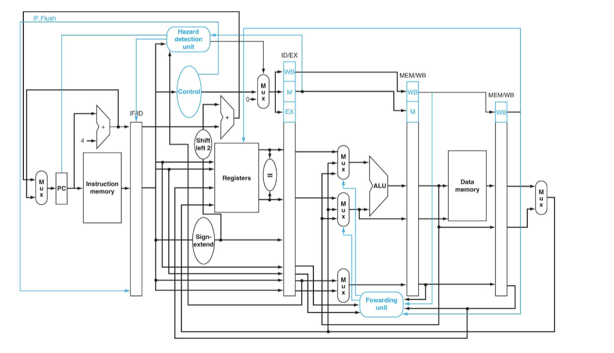
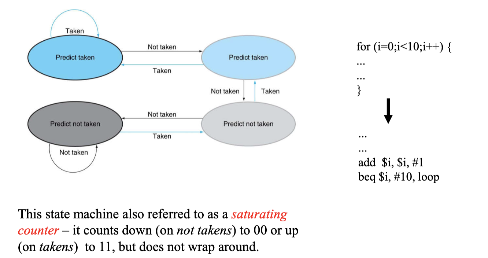

# CSE141 08: Branch Hazards

To view the original lecture notes provided by the professor, please visit at [this link](files/cse141_08.pdf).

And for the appendix(Branch Prediction), please visit at [this link](files/cse141_08_A.pdf).

- [CSE141 08: Branch Hazards](#cse141-08-branch-hazards)
  - [Branch Hazards](#branch-hazards)
  - [Dealing With Branch Hazards](#dealing-with-branch-hazards)
  - [Stalling for Branch Hazards](#stalling-for-branch-hazards)
    - [Assume Branch Not Taken](#assume-branch-not-taken)
    - [Branch Hazards – Predicting Taken?](#branch-hazards--predicting-taken)
  - [Branch Target Buffer](#branch-target-buffer)
  - [MIPS R2000 Solution](#mips-r2000-solution)
  - [The Pipeline with flushing for taken branches](#the-pipeline-with-flushing-for-taken-branches)
  - [Branch Delay](#branch-delay)
    - [Filling the branch delay slot](#filling-the-branch-delay-slot)
  - [Branch Prediction](#branch-prediction)
    - [Two-bit predictors give better loop prediction](#two-bit-predictors-give-better-loop-prediction)
    - [Branch History Table (bimodal predictor)](#branch-history-table-bimodal-predictor)
    - [Correlating Branch Predictors](#correlating-branch-predictors)
  - [Control Hazards --Key Points](#control-hazards---key-points)

## Branch Hazards
- Branch dependences can result in branch hazards (when 
they are too close to be handled correctly in the pipeline).

## Dealing With Branch Hazards
- Hardware
  - stall until you know which direction
  - reduce hazard through earlier computation of branch direction
  - guess which direction
    - assume not taken (easiest)
    - more educated guess based on history (requires that you know it is a 
branch before it is even decoded!)
- Hardware/Software/ISA
  - nops, or instructions that get executed either way (delayed branch).

## Stalling for Branch Hazards
- Seems wasteful, particularly when the branch isn’t taken.
- Makes all branches cost 4 cycles.
- Also, requires you know that it’s a branch before you 
decode it (several of our solutions have this problem)

### Assume Branch Not Taken
- Performance depends on percentage of time you guess 
right.
- Flushing an instruction means to prevent it from changing 
any permanent state (registers, memory, PC).
    - sounds a lot like a bubble...
    - But notice that we need to be able to insert those bubbles later in 
the pipeline

### Branch Hazards – Predicting Taken?
Requiredinformation to predict Taken:
1. Whether an instruction is a branch (before decode)
2. The target of the branch
3. The outcome of the branch condition

## Branch Target Buffer
- Keeps track of the PCs of recently seen branches and their 
targets.
- Consult during Fetch (in parallel with Instruction Memory 
read) to determine:
    -  Is this a branch?
    - If so, what is the target

## MIPS R2000 Solution
- We are going to walk through the solutions they used for 
the initial commercial MIPS pipeline.
- Just be aware, many of those do not transfer to modern 
architectures.
- But this will lay the foundation for modern techniques, 
which we’ll look at in some detail.

## The Pipeline with flushing for taken branches

Notice the IF/ID flush line added.
- Not our final design yet, so don’t need to study this too hard.
- MIPS ISA choice -> beq, blt, ...]

## Branch Delay
- There’s no rule that says we have to see the effect of the 
branch immediately.  Why not wait an extra instruction 
before branching?
- The original SPARC and MIPS processors each used a 
single branch delay slot to eliminate single-cycle stalls 
after branches.
- The instruction after a conditional branch is always 
executed in those machines, regardless of whether the 
branch is taken or not!

### Filling the branch delay slot
- The branch delay slot is only useful if you can find 
something to put there.
- If you can’t find anything, you must put a nop to insure 
correctness.
- Where do we find instructions to fill the branch delay slot?

## Branch Prediction
- Always assuming the branch is not taken is a crude form of branch prediction.

- What about loops that are taken 95% of the time?
  - we would like the option of assuming not taken for some branches, 
and taken for others, depending on ???

### Two-bit predictors give better loop prediction

### Branch History Table (bimodal predictor)
- has limited size
- 2 bits by N (e.g. 4K)
- uses low bits of branch address to choose entry
- what about even/odd branch?

### Correlating Branch Predictors
The global history register (ghr) is a shift register that 
records the last n branches (of any address) encountered by 
the processor.

## Control Hazards --Key Points
- Control (or branch) hazards arise because we must fetch 
the next instruction before we know if we are branching or 
where we are branching.
- Control hazards are detected in hardware.
- We can reduce the impact of control hazards through:
  - early detection of branch address and condition
  - branch prediction
  - branch delay slots